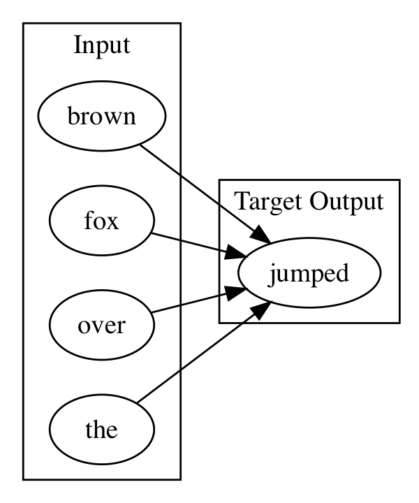

!SLIDE center subsection

# 数据摄取的案例研究: 文本

!SLIDE

# 目录

* 预处理和标记
* 词袋模型
* 多元文法 (N-Grams)
* Word2Vec
* 段落向量
* GloVE
* 文字作为字符序列 (Words as Sequence of Characters)

!SLIDE
# 目录

* **&rArr;** 预处理和标记
* 词袋模型
* 多元文法 (N-Grams)
* Word2Vec
* 段落向量
* GloVE
* 文字作为字符序列 (Words as Sequence of Characters)

!SLIDE

# 预处理和标记

* 标记
	* 将连串的单词分成不同的单词
	  * DefaultTokenizer
	  * NGramTokenizer
  	  * PosUimaTokenizer
	  * UimaTokenizer
* 预处理
  * LowCasePreProcessor
  * StemmingPreprocessor

!SLIDE

# 目录

* 预处理和标记
* **&rArr;** 词袋模型
* 多元文法 (N-Grams)
* Word2Vec
* 段落向量
* GloVE
* 文字作为字符序列 (Words as Sequence of Characters)

!SLIDE

# 词袋模型

语料库以其单词的词袋呈现。

* 无语法
* 无秩序
* 只呈现频率

"Bob and Carol and Ted and Alice"

变成列表
["Bob","and","Carol","Ted","Alice"]

单词频率
 [1,3,1,1,1]

!SLIDE

# 词袋模型用法

* 文档频率 Term Frequency–Inverse Document Frequency (TfIDF)
  * 统计数据，旨在反映一个单词对一个集合或文集文档的重要性

!SLIDE

# 词袋模型例子

* 实验文件里有该例子
* Tokenizer从目录读取文件和使用文件名当标签

		TokenizerFactory tokenizerFactory = new DefaultTokenizerFactory();
        LabelAwareIterator iterator = new FilenamesLabelAwareIterator
		.Builder()
                .addSourceFolder(new ClassPathResource("bow").getFile())
                .useAbsolutePathAsLabel(false)
                .build();

!SLIDE

# 词袋模型例子

* 显示迭代器内容的代码

		while(iterator.hasNext()){
            LabelledDocument doc = iterator.nextDocument();
            System.out.println(doc.getContent());
            System.out.println(doc.getLabels().get(0));
        }

        iterator.reset();

!SLIDE

# B词袋模型例子

	BagOfWordsVectorizer vectorizer = new BagOfWordsVectorizer.Builder()
                .setMinWordFrequency(1)
                .setStopWords(new ArrayList<String>())
                .setTokenizerFactory(tokenizerFactory)
                .setIterator(iterator)
                .build();
	vectorizer.fit();

!SLIDE

# 词袋模型例子

* 用于探索词袋模型内容的代码

		log.info(vectorizer.getVocabCache().tokens().toString());
		System.out.println(vectorizer.getVocabCache().totalNumberOfDocs());
		System.out.println(vectorizer.getVocabCache().docAppearedIn("two."));
		System.out.println(vectorizer.getVocabCache().docAppearedIn("one."));
		System.out.println(vectorizer.getVocabCache().docAppearedIn("world"));

!SLIDE

# 目录

* 预处理和标记
* 词袋模型
* **&rArr;** 多元文法 (N-Grams)
* Word2Vec
* 段落向量
* GloVE
* 文字作为字符序列 (Words as Sequence of Characters)

!SLIDE

# 多元文法 (N-Grams)

* 从一系列文本中连续的n项序列
* 示例文本 ***"It is the year 2016"***
  * 提取两个字
	* "It is"
	* "is the"
	* "the year"
	* "year 2016"
  * 提取三个字
	* "It is the"
	* "is the year"
	* "the year 2016"

!SLIDE

# 多元文法 (N-Grams) 用法

* 比词袋模型提供更多的上下文信息
* 在一些神经网络中用于语音识别以缩小预测范围
  * RNN根据前2个预测单词中的x最高百分比中，预测下一个单词

!SLIDE

# 代码例子: DL4J 里的 NGrams

	public static void main(String[] args) throws Exception{
        String toTokenize = "To boldly go where no one has gone before.";
        TokenizerFactory factory =
		new NGramTokenizerFactory(new DefaultTokenizerFactory(), 1, 2);

		Tokenizer tokenizer = factory.create(toTokenize);
        factory = new NGramTokenizerFactory
		(new DefaultTokenizerFactory(), 2, 3);

        List<String> tokens = factory.create(toTokenize).getTokens();
        log.info(tokens.toString());

输出

	[To, boldly],  [boldly, go],  [go, where],......
	[To, boldly, go],  [boldly, go, where] ......

!SLIDE

# 目录

* 预处理和标记
* 词袋模型
* 多元文法 (N-Grams)
* **&rArr;** Word2Vec
* 段落向量
* GloVE
* 文字作为字符序列 (Words as Sequence of Characters)

!SLIDE

# Word2Vec

* 单词嵌入模型
* 向量空间
* 在语料库的每个单词 => 多维向量空间中的向量
* 向量空间中的相对位置表示关系
	* Boy->Man 的距离和方向
	* Girl->Woman 的距离和方向

!SLIDE

# Word2Vec - 生成向量空间

* 神经网络返回移动窗口的单词概率
	* “巴黎”这个词，从词汇的语料库中可以预测在“巴黎”五个词范围中的概率
* One-hot 向量, 其向量维度为整个语料库中词的总数
* 除了1代表该单词外全部为0
* 参考示范 https://ronxin.github.io/wevi/
* 请参考intellij的例子
* 允许你做单词数学
	* King - Man + Woman = (?) Queen

!SLIDE

# One-hot 编码

* One-hot 向量, 其向量维度为整个语料库中词的总数, 除了1代表该单词外全部为0

!SLIDE

# 构建word2vec的两个方法

* CBOW
  * w1,w2,w4,w5作为神经网络的输入
	  * 上下文语境
  * 以w3作为焦点训练网络
	  * 焦点词
* SKIP GRAM
  * CBOW 的相反
  * 输入是焦点词
  * 输出是上下文语境

!SLIDE

# CBOW 图表

!SLIDE

# CBOW 图表

!SLIDE

# CBOW 图表

!SLIDE

# CBOW 图表

!SLIDE

# 目录

* 预处理和标记
* 词袋模型
* 多元文法 (N-Grams)
* Word2Vec
* **&rArr;** 段落向量
* GloVE
* 文字作为字符序列 (Words as Sequence of Characters)

!SLIDE

# 段落向量/doc2Vec

* Word2Vec的扩展
  * Word2Vec将单词与单词相关联
  * doc2vec有额外的标签
  * 用于情绪分析

!SLIDE

# 目录

* 预处理和标记
* 词袋模型
* 多元文法 (N-Grams)
* Word2Vec
* 段落向量
* **&rArr;** GloVE
* 文字作为字符序列 (Words as Sequence of Characters)

!SLIDE

# GloVE

* 单词向量从无监督共存词语训练中获得
* 有预训练向量
  * 维基百科
  * 推特

!SLIDE

# 目录

* 预处理和标记
* 词袋模型
* 多元文法 (N-Grams)
* Word2Vec
* 段落向量
* GloVE
* **&rArr;** 文字作为字符序列 (Words as Sequence of Characters)

!SLIDE

# 文字作为字符序列

* 文本可以作为字符序列来处理;
* 神经网络可以被训练来回答这个问题 "当给予输入字符X,预测下一个字符"; 然后重复

!SLIDE

# 字符vs单词为单位的分析

* 有多少个单词?
* 有多少个字符？
* 文本->文字处理难度高
  * 前缀, 后缀, 其他
  * "old school" , "New York"

!SLIDE

# 使用循环神经网络来编写天气预报

在详细描述LSTM RNN的内容之后, 实验时间时我们将会训练一个神经网络，从学习语料库中，逐次生成字符， 预测天气预报。

然后训练。

***Instructor note, foreshadow the lab , do not start the lab yet, next chapter ***

!SLIDE
