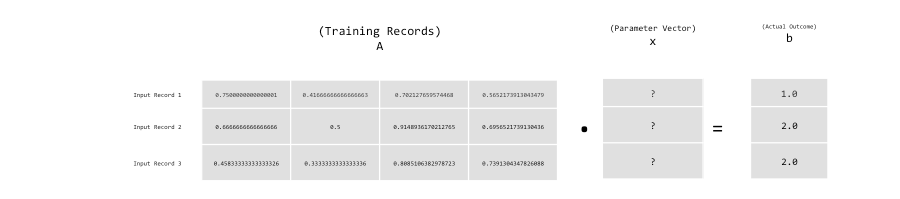
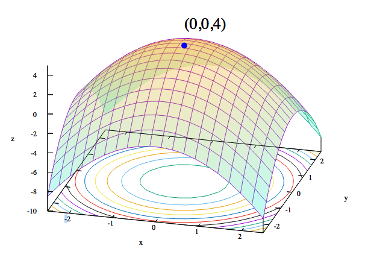

!SLIDE center subsection

# 什么是深度神经网络？

!SLIDE

#应用深度神经网络

## 神经网络具体构思

* 需定义以下来建立模型
	* 什么形态的训练数据?
	* 什么模型适合这种数据？
	* 怎么样的输出形式？
* 这些问题将定义机器学习的的处理管道

!SLIDE

#  神经网络里，寻非线性方程里的矩阵x
## Ax = b

* A 矩阵
	* 输入数据组成的矩阵
* x 向量
	* 代表模型的参数矢量
* b 向量
	* 输出数据/标签组成的矩阵，与A矩阵的行数量一样

!SLIDE

#Ax = b 图释

!SLIDE

#线性代数术语

* 纯量
	- 向量中的元素
	- 又称变量
* 向量
	* 由元素所组成的数组
* 矩阵
	* 由向量排列成的矩形陣列，每行的元素数量需一致

!SLIDE

#求解方程组
* 两个方法
	* 直接法
	* 迭代法
* 直接法
	* 固定的计算回合给予答案
	* 数据需占据记忆
	* 例子：高斯消去法, 正规方程
* 迭代法
	* 经过一系列的步骤直到收敛
    * 随机剃度算法

!SLIDE

# 求解方程组
* 神经网络使用迭代方法来解方程组

~~~SECTION:notes~~~

This is a presenter note example.

~~~ENDSECTION~~~

!SLIDE

# 训练神经网络

* 输入值: 想从中产生信息的数据
* 权重项训练出来的特征参数和偏置项代表模型
* 学习算法经过反复的反向传播更改权重项

!SLIDE

# 对训练数据进行拟合

!SLIDE

# 优化

* 优化算法通过迭代更改权重项
	* 直到错误最小化
* 误差 = 预测值 - 实际值
* 损失函数测量误差
	* 常用的损失函数: 均方误差
*如何在下个迭代步骤里更改x参数向量

!SLIDE

# 凸优化

!SLIDE

#梯度下降
* 直观的解释:
	* 把参数空间视成在座山，沿着最陡峭最易下山的位置走一步
	* 如果损失函数是凸函数，山峰低处将是全局最优解
* 沿着梯度向量相反的方向，也就是导数的反方向
  * 向梯度减少最快的位置前进，以寻找函数的最小值
	* 然后继续求解当前位置梯度

!SLIDE

# 随机梯度下降
* 基本梯度下降扫描全部训练数据集来计算下降
* 而随机梯度下降时随机选一个数据进行计算，加快了迭代速度

!SLIDE
# 随机梯度下降图释

