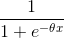

!SLIDE center subsection

# 前馈神经网络

!SLIDE

# 前馈神经网络

* 与卷积神经网络和循环神经网络共享许多特征
* 也名为多层感知器
* 在1940年代- 1960年代开发的

!SLIDE

# 深度学习的复兴

* GPU的兴起成就了有效的配置
* 庞大的训练集

!SLIDE

# 前馈神经网络

!SLIDE

# 具有两个隐藏层的神经网络

!SLIDE

# 节点之间的连接

* 旨在有选择性和可训练
* 过滤，聚合，转换，放大，忽略传递给下一个神经元的内容
* 这转换将原始输入转换为有用的信息
* 输入层有可训练的权重值
* 输出值由激活函数决定

!SLIDE

# 神经网络图表解释

* 神经元 J

!SLIDE

# 神经网络图表解释

* 神经元输入值
  * 输入值是由【输入层的输出值 * 该当输出值的权值】决定

* 权值
  * 随机分配
  * 权值0代表输入值将被忽略
  * 大的权值代表输入值将被放大
  * 随着网络训练，权值将会调整

* 神经元输出值
	* 输出值是由输入值 * 权值，激活函值决定
  * Sigmoid 激活将低值定成0，高值定成1，在S曲线之间
  * ReLu 激活将值低于0 定于0， 高于0将以线性模式呈现

!SLIDE

# 关键术语

* 激活函数
  * 以非线性模式映射输入值的非线性函数
* 损失函数
  * 如何计算错误
* 权重
  * 神经网络中的权重是将神经元的输入值进行缩放（放大或最小化）的系数
* 反向传播
  * 求梯度的方法

!SLIDE

# 训练神经网络

* 输入值: 您想从中产生信息的数据
* 权重与偏重项：控制网络的活动
* 学习函数：改变权重和偏导

!SLIDE

# 低度拟合与过度拟合
* 低度拟合
	* 网络对数据训练不够充分
	* 模型在测试新数据上表现不佳
* 过度拟合
  * 模型在训练数据了t提供高准确度分数
  * 模型在测试新数据上表现不佳

!SLIDE

# 逻辑回归

* 逻辑回归模型的3个部分
	* 假设 (逻辑函数): 
    * 从参数向量x和输入数据特征给予预测
	* 价值函数
		* 例子: “最大似然估计法”
		* 让我们知道预测离实际值有多远
	* 更新函数
		* 价值函数的导数
		* 让我们知道该怎么走/要采取多少步骤

!SLIDE

# 评价和混淆矩阵

* 表呈现
	* 预测 vs 实际输出
* 我们将这些答案计算在内， 以获得以下
	* 真阳性
	* 假阳性
	* 真阴性
	* 假阴性
* 允许我们不靠平均的准确率对模型进行评估
  * 可以看出模型是否能在准确性高同时执行良好？

!SLIDE

# 混淆矩阵

