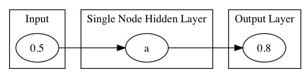
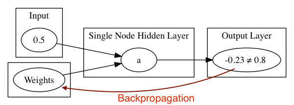

!SLIDE center subsection

# 神经网络示范

本章节使用最简单的例子介绍神经网络

!SLIDE
# 神经网络例子

* 神经网络例子细节
* 神经网络例子实验
* 关键的网络设定
* VGG-16 示范

!SLIDE

# 神经网络例子

## 目标: 输入值=0.5 输出值=0.8

!SLIDE

# 设置:
* 应用随机权重与神经元个别的激活函数 => 输出值

* 测验结果: -0.23 == 0.8 ?

!SLIDE

# 计算误差

* 使用反向传播调权重项
* 重复以上步骤

!SLIDE

#神经网络的输出层可以为不同的目的进行配置

* 二分类
* 多分类
* 回归
* 其他...

!SLIDE

# 简单网络的设置

简单网络拥有值得注意的设置，因为它们将出现在所有神经网络中

* 学习速率
* 优化方法 (updater)
* 输出层激活函数
* 隐藏层激活函数
* 循環週期次数
* 误失函数

!SLIDE

# 从简单网络做推断

* 简单网络使用一个输入值和一个输出值，训练网络来预测正确的输出值
* 一般的神经网络会经过同样的过程与拥有更复杂的数据
* 输入数据可以是图像，文本，语音记录等等
* 输出数据可以是 T/F, 连续值, 标签

~~~SECTION:notes~~~

# Sharpen the correlation from simple to complex

Multiple GPU support
• 4 x NVIDIA Titan, off-the-shelf workstation
• data parallelism for training and testing
• ~3.75 times speed-up, 2-3 weeks for training

~~~ENDSECTION~~~

!SLIDE

# 简单网络实验

* 简单网络示范

!SLIDE

# VGG-16 示范

* VGG-16 较复杂神经网络示范

!SLIDE

# 问题

* 随机梯度下降是以下那个例子
  * A. 优化方法
  * B. 激活函数
  * C. 损失函数

~~~SECTION:notes~~~
Review Lab and add questions as appropriate

* What is the Learning Rate and what effect does it have on the Neural Network?
* Activation Function is set per Layer or for the whole Network?
* The error of the output compared to the expected output is?
  A. Loss Function
  B. Sigmoid Function
  C. Learning Rate
* 为什么需要深入的学习?

以下哪个领域需要主题专家？

A. 深度学习 B.机器学习

~~~ENDSECTION~~~

!SLIDE
