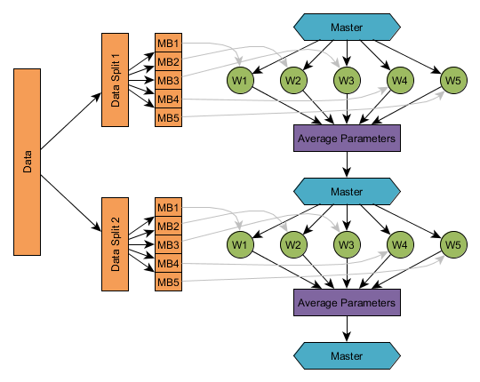

!SLIDE

# Distributed Training in Spark

* Documentation 
  * https://deeplearning4j.org/spark
* Examples
  * https://github.com/deeplearning4j/dl4j-examples/tree/master/dl4j-spark-examples

!SLIDE

# Non-Distributed Training overview

* Process minibatch
  * Calculate Loss Function
  * Calculate direction of less error
  * Update weights in that direction

!SLIDE

# Non-Distributed Training Challenges

* Number of parameters may be large
* CPU or preferably GPU intensive
* Update large multi-dimensional matrix of numeric values

!SLIDE 

# Distributed Training Implementation

* Workers process minibatch
* Calculate Loss Function
* Calculate Gradient update
* Submit to Parameter server
* Parameter Server averages weights from workers
* Ships averaged weights to workers

!SLIDE

!SLIDE

# DL4J Spark Examples

* https://github.com/deeplearning4j/dl4j-examples/tree/master/dl4j-spark-examples

!SLIDE

# Minimal Example

	JavaSparkContent sc = ...;
	JavaRDD<DataSet> trainingData = ...;
	MultiLayerConfiguration networkConfig = ...;

	//Create the TrainingMaster instance
	int examplesPerDataSetObject = 1;
	TrainingMaster trainingMaster = new ParameterAveragingTrainingMaster.Builder(examplesPerDataSetObject)
        .(other configuration options)
        .build();

	//Create the SparkDl4jMultiLayer instance
	SparkDl4jMultiLayer sparkNetwork = new SparkDl4jMultiLayer(sc, networkConfig, trainingMaster);

	//Fit the network using the training data:
	sparkNetwork.fit(trainingData);

!SLIDE

# How to Participate and Contribute

* Chat with us on Gitter
  * https://gitter.im/deeplearning4j/deeplearning4j
* Contribute
  * https://github.com/deeplearning4j/

!SLIDE

# Interesting Challenges

* GPU aware Yarn
  * https://issues.apache.org/jira/browse/YARN-5517
* Parallelism in DeepLearning
  * https://static.googleusercontent.com/media/research.google.com/en//archive/large_deep_networks_nips2012.pdf

 
  
  
