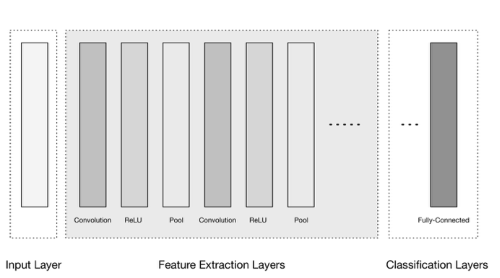
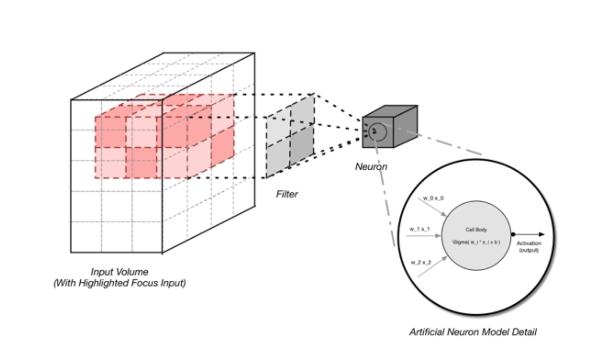
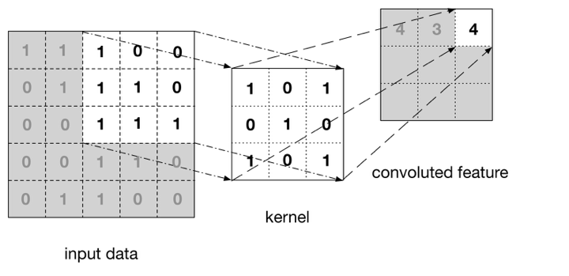
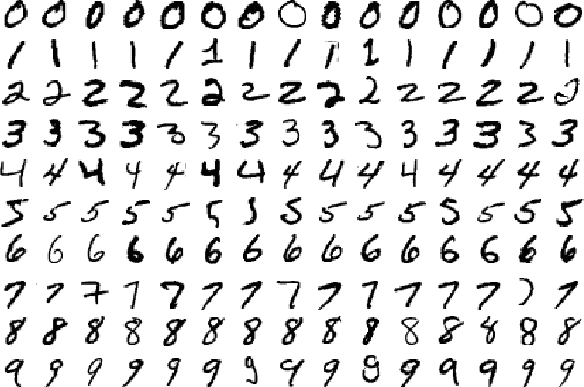
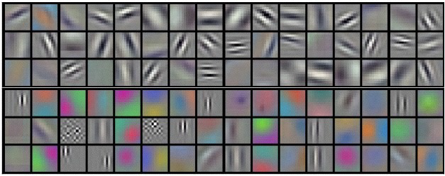
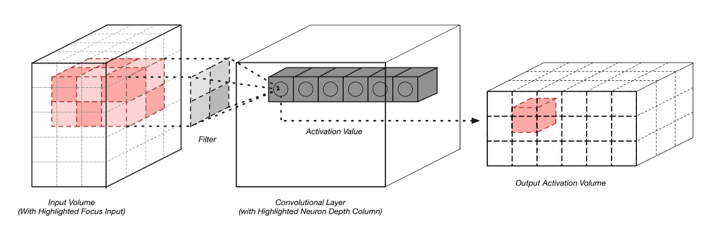

!SLIDE center subsection

# 卷积神经网络

!SLIDE

# 卷积神经网络

* 卷积神经网络是目前图像分类领域的最佳选择
* 使用本地连接的过滤器“扫描”图像数据中的特征
	* 能够处理图像特征的缩放和旋转
* 通常是以下重复模式：
  * 卷积层
  * ReLu层
  * Pooling层

!SLIDE

# 卷积神经网络

# Note mention recent move to less Pool Layers

!SLIDE

# 卷积网络图像解释

* 卷积层过滤x来提取特征
	* 过滤器探索局部空间，同时保持空间关系
* Pooling层结合本地信息，减少分辨率
  * pooling 具有平移不变性
* 用局部结构从x来预测y (例子, 图像, 短时间序列数据)
  * 2D: 分类猫的的图像, 猫可能出现在不同的地方
  * 1D: 从实验室时间序列中诊断患者, 症状在不同的时间出现
* 特殊情况: 没有任何MLP的完全卷积网络 (可变大小x的滤波器)

!SLIDE

# 卷积神经网络

!SLIDE

# 三维输入

!SLIDE

# 卷积

!SLIDE

# Mnist数字

!SLIDE

# 训练成的过滤器

!SLIDE

# 建筑三维输出

!SLIDE
