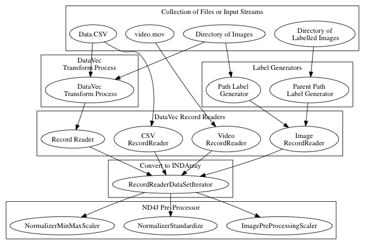

!SLIDE center subsection

# DataVec

* 神经网络处理数值性数组
* Datavec 把所持有的数据转换成数值性数组

!SLIDE

# 数据来源

* 日志文件
* 文本文档
* 列表数据
* 图像和视频
* 其他

!SLIDE

# 目标

* 为数据管道构建一个用户友好的综合工具包，以便用于神经网络

!SLIDE

# DataVec 特征

* 转换器
* 缩放
* 混洗
* 连接
* 分成训练与测试数据

!SLIDE

# 常用的特征

* RecordReaders
  * 读取文件或输入，转换为列表（List of Writables）
* Normalizers
  * 标准化，缩放或标准化数据
* Transform Process
  * 连接数据, 用数字代替字符串, 抽取标签

!SLIDE

# 可用的ETL路径图



!SLIDE


# DataVec 图像基础

* 图像是像素值的数组


!SLIDE

# 代码例子: 加载上面的图像为INDArray

```
    INDArray imagematrix = loader.asMatrix(image);
		System.out.println(imagematrix);
```

# 输出值

```
[[[[255.00, 255.00, 255.00, 255.00],
   [255.00, 0.00, 0.00, 255.00],
   [255.00, 0.00, 0.00, 255.00],
   [255.00, 255.00, 255.00, 255.00]]]]
```

!SLIDE

# 代码例子: 缩放像素值介于0和1之间

```
    DataNormalization scaler = new ImagePreProcessingScaler(0,1);
    scaler.transform(imagematrix);
```

# 输出值

```
[[[[1.00, 1.00, 1.00, 1.00],
   [1.00, 0.00, 0.00, 1.00],
   [1.00, 0.00, 0.00, 1.00],
   [1.00, 1.00, 1.00, 1.00]]]]
```

!SLIDE

# 使用DataVec处理图像

* 将图像缩放至于RecordReader相同的尺寸
* 在训练例子里的数据管道

```
ImageRecordReader recordReader = new ImageRecordReader(height,width,channels);
```

* 将图像缩放至于NativeImageLoader适当的维数
* 使用于一次性的推理

```
NativeImageLoader loader = new NativeImageLoader(height, width, channels); \\ load and scale
INDArray image = loader.asMatrix(file); \\ create INDarray
INDArray output = model.output(image);   \\ get model prediction for image
```

!SLIDE

# 代码例子: 图像转换

* 缩放像素值

```
DataNormalization scaler = new ImagePreProcessingScaler(0,1);
scaler.fit(dataIter);
dataIter.setPreProcessor(scaler);
```


!SLIDE

# 增加图像数据集

* 使用OpenCV/DataVec工具包增加训练数据
	* 转换
	* 裁剪
	* 倾斜

!SLIDE

# 添加标签

* ParentPathLabelGenerator
* PathLabelGenerator

!SLIDE

# 可用的RecordReaders

* 可用的RecordReaders表:
  * https://deeplearning4j.org/etl-userguide

!SLIDE

# ND4J 预处理器

* ImagePreProcessingScaler
  * 缩放默认值范围为【0，1】， 可更改范围值
* NormalizerMinMaxScaler
  * 限制缩放范围为【0，1】
* NormalizerStandardize
  * 移动列方差和平均值
  * 无需预处理

!SLIDE

# 使用JavaCV, OpenCV, ffmpeg的图像转换

* 库已包含其中

!SLIDE

# 图像管道: 单一图像输入预训练模型


!SLIDE


# 代码例子: CSV数据转换成INDArray


	public class CSVExample {
	private static Logger log = LoggerFactory.getLogger(CSVExample.class);
	public static void main(String[] args) throws  Exception {
        //First: get the dataset using the record reader.
		//CSVRecordReader handles loading/parsing
        int numLinesToSkip = 0;
        String delimiter = ",";
        RecordReader recordReader =
		new CSVRecordReader(numLinesToSkip,delimiter);
        recordReader.initialize(new FileSplit
		(new ClassPathResource("iris.txt").getFile()));


!SLIDE

# 代码例子: CSV数据转换成INDArray

	//Second: the RecordReaderDataSetIterator
		//handles conversion to
		//DataSet objects, ready for use in neural network
        int labelIndex = 4;     
		//5 values in each row of the iris.txt CSV:
		//4 input features followed by an integer label (class) index.
		//Labels are the 5th value (index 4) in each row
        int numClasses = 3;     
		//3 classes (types of iris flowers) in the iris data set.
		//Classes have integer values 0, 1 or 2
        int batchSize = 150;
		//Iris data set: 150 examples total.
		//Loading all of them into one DataSet
		//(not recommended for large data sets)

        DataSetIterator iterator =
		new RecordReaderDataSetIterator
		(recordReader,batchSize,labelIndex,numClasses);
        DataSet allData = iterator.next();

!SLIDE

# DataVec 代码讲解

* RecordReader recordReader = new CSVRecordReader(numLinesToSkip,delimiter);
	* A RecordReader prepares a list of Writables
	* A Writable is an efficient Serialization format
* DataSetIterator iterator = new RecordReaderDataSetIterator
	* We are in DL4J know, with DataSetIterator
	* Builds an Iterator over the list of records
* DataSet allData = iterator.next();
	* Builds a DataSet
	* INDArray of Features, INDArray of Labels


!SLIDE

# 常用的DataVec类

* CSVRecordReader
	* CSV文本数据
* ImageRecordReader
	* 将图像转换为含有像素值的数字数组
*  JacksonRecordReader
	* 解析JSON记录
* ParentPathLabelGenerator
	* 根据目录路径构建标签
* Transform, Transform Process Builder, TransformProcess
	* 转换工具包


!SLIDE
