!SLIDE center subsection

# 前馈神经网络

本章节对前馈网络加以说明。

!SLIDE

# 具有一个,两个隐藏层的神经网络

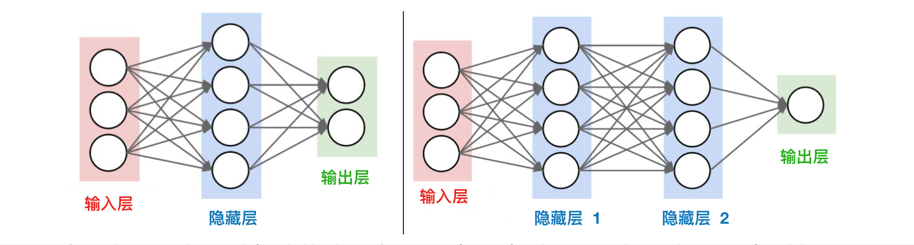

!SLIDE

# 前馈神经网络

* 最简单的神经网络模型
* 资料经由输入层通过隐藏层(hidden layer)到输出层单向传播，神经元（neuron)之间没有连接迴路存在

!SLIDE

# 前馈神经网络

* 也名为多层感知器 （Multi Layer Perceptron)
* 采用监督事学习方法
* 具有一个或多个隐层，相邻两层之间通过权值全连接 (全连接层 - Fully connected layers)
* 前馈网络可以看作一个函数，通过简单非线性函数的多次复合，实现输入空间到输出空间的复杂映射

!SLIDE

# 神经网络图表解释

* 神经元输入值
  * 输入值是由【输入层的输出值 * 该当输出值的权值】决定

* 权值
  * 随机分配
  * 权值0代表输入值将被忽略
  * 大的权值代表输入值将被放大
  * 随着网络训练，权值将会调整

* 神经元输出值
	* 输出值是由输入值 * 权值，激活函值决定

!SLIDE

# 前馈网络示范

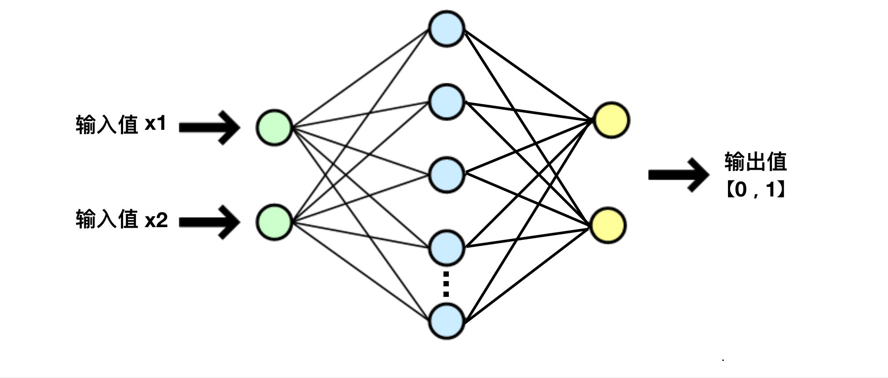

!SLIDE

# 前馈网络示范

* 1000个输入数据， 200个测试数据
* 数据以csv格式存储

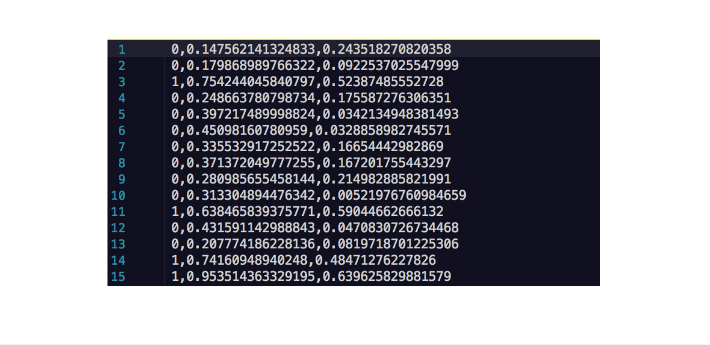

!SLIDE

# 前馈网络示范

* 输入层和输出层各两个神经元
* 隐藏层设为20个神经元

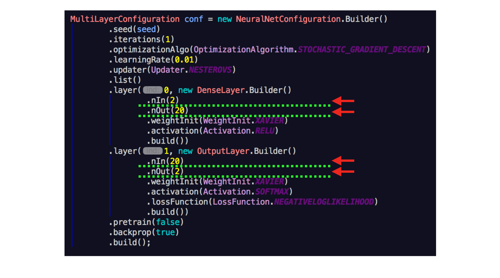

!SLIDE

# 关键术语

* 激活函数
  * 通过非线性转换函数，从输入值映射到输出值
  * Sigmoid, TanH, ReLu, Softmax...
* 损失函数
  * 如何计算错误
  * 均方损失（Mean Squared Loss), 负对数似然函数(Negative Log Likelihood)

!SLIDE

# 前馈网络示范

* 激活函数
  * 隐藏层 - ReLu 函数, 输出层 - Softmax 函数
* 损失函数
  * 输出层 - Negative Log Likelihood 函数
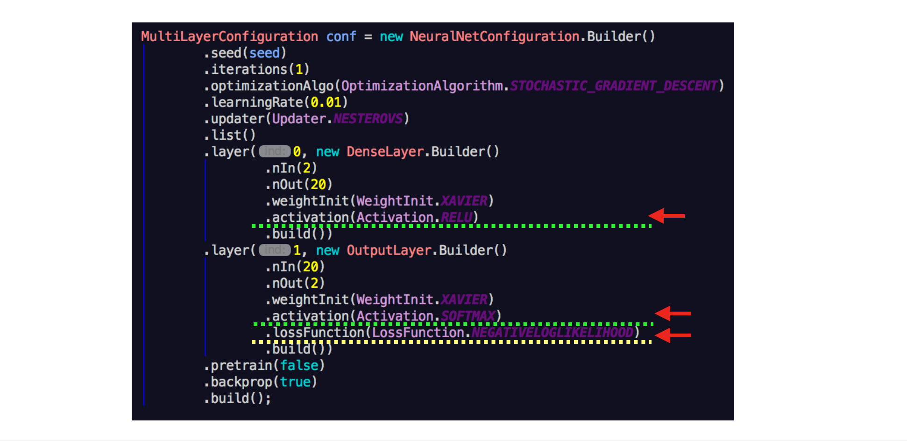

!SLIDE

# 关键术语

* 初始值
  * 权重应该以促进学习的方式进行初始化
  * 错误的初始化会使梯度变得太大或太小，使其难以更新权重
  * Xavier(有效的促进训练于调整权重), ReLu

* 优化方法
  * 如何找到优的最佳解（误差的最小值)
  * 线性梯度下降算法(Line Gradient Descent), 随机梯度下降算法(Stochastic Gradient Descent)

!SLIDE

# 前馈网络示范

* 初始值
  * Xavier初始化
* 优化方法
  * 随机梯度下降算法

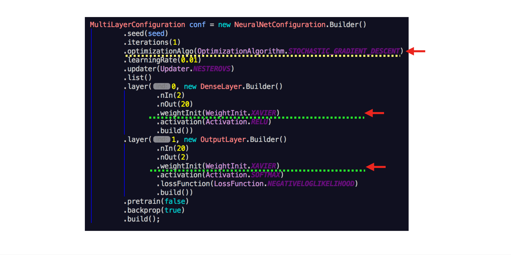

!SLIDE

# 关键术语  

* 学习速率
  * 学习速率值小： 进展平稳但缓慢
  * 学习速率值高： 进步更快但陷入局部最小值的风险更大
  * 典型值: 0.000001 ~ 0.1
* 批量大小（batch size)
  * 一个前向传播，反向传播(称为迭代)的数据集
  * 网络可训练的更快

!SLIDE

# 前馈网络示范

* 学习速率
  * 定于0.01
* 批量大小
  * 定于50

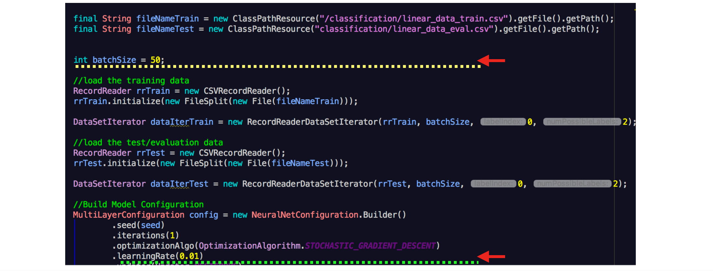

!SLIDE

# 关键术语  

* epochs
  * 对数据集的完整传递（前向传播，反向传播）的次数
  * 根据网络复杂性以定 （1 ～ 100）

!SLIDE

# 前馈网络示范

* epochs
  * 定于30
    * 批量大小为50, 训练数据为1000，epoch为30，那一个Epoch将有20个迭代数

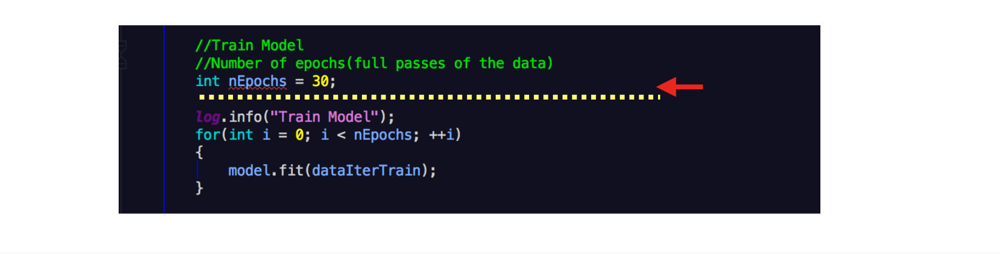

!SLIDE

# 前馈网络示范结果

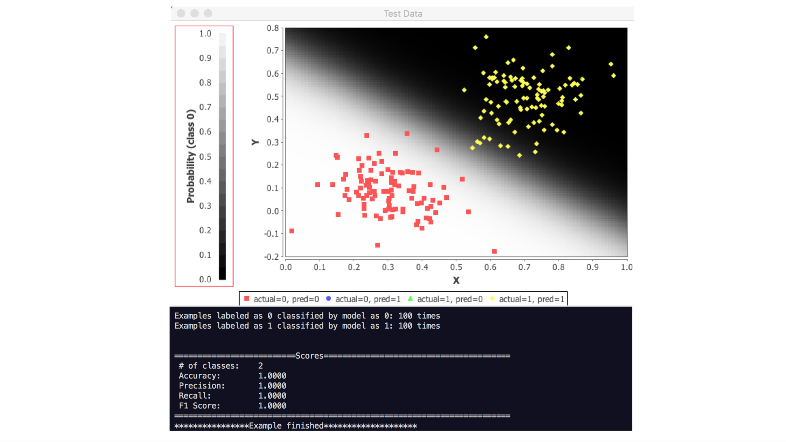

!SLIDE

# 设置层数量及各层神经元的数量

*  拥有更多层数量和神经元的神经网络可以表达更复杂的问题
  * 但可能会导致过度拟合

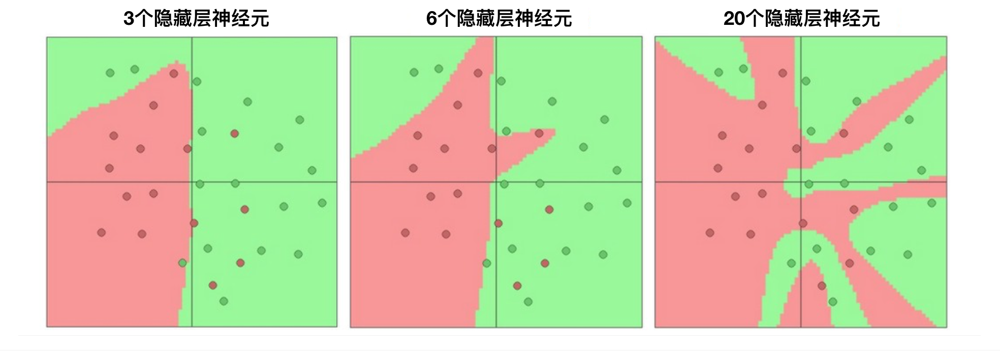

!SLIDE

# 评价模型

!SLIDE

# 评价模型

* 准确度(Accuracy)
  * 预测值与真实值的接近程度
* 精确度(Precision)
  * 测量结果与被测量真值的一致程度

!SLIDE

# 准确度, 精确度

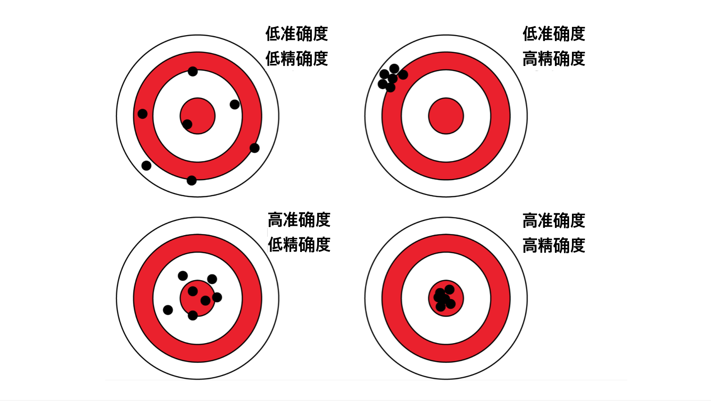

!SLIDE

# 评价模型

* Recall 召回率
  * 真阳性率 Sensitivity
  * 度量输入数据分类为正类和其分类是正确的频率

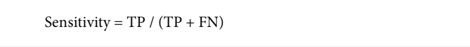

!SLIDE

# 评价模型

* F1
  * 对模型的准确性衡量
  * F1的分数在0.0到1.0之间，其中0.0是最差的分数，1.0是我们希望看到的最好的分数

  

!SLIDE

# DeepLearning4J训练用户界面

* 左上：模型得分 vs 迭代 （这是对目前小批量所产生的损失价值）
* 右上：模型与训练信息
* 左下：每层网络权重参数更新的比率 vs 迭代
* 右下：激活函数，梯度， 优化方法的标准偏差 vs 迭代

