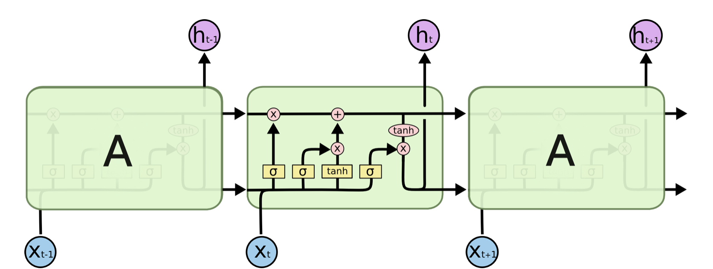
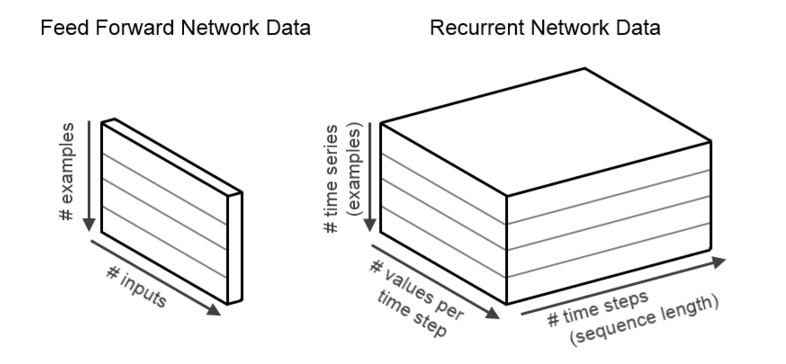
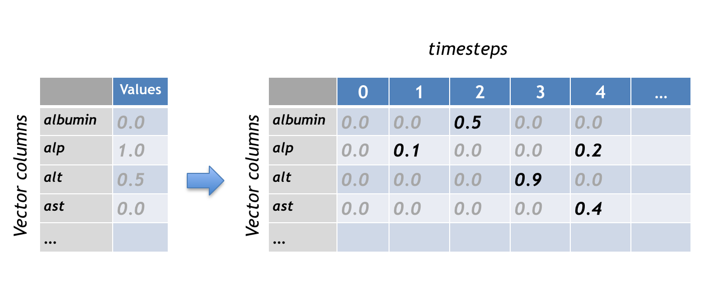

!SLIDE center subsection

# 目录

* 循环神经网络(RNN)概述
* RNN的优势
* 建模序列
* 沿时间反向传播
* 调优指南
* PhysioNet例子

!SLIDE

# 目录

* **&rArr;** 循环神经网络(RNN)概述
* RNN的优势
* 建模序列
* 沿时间反向传播
* 调优指南
* PhysioNet例子

!SLIDE

# 循环神经网络(RNN)概述

* 带隐藏状态的前馈网络
* 拥有内部动态的隐藏状态
* 信息可以存储在“隐藏状态”中很长一段时间

!SLIDE

# 长短期记忆(LSTM)使用案例

* 手写识别
* 序列数据, 时间序列数据
* 序列生成
* 序列分类

!SLIDE

# 长短期记忆(LSTM)

* 将神经网络的动态状态看作是短期的
* 我们想要使这一过程持续很长时间（从原本RNN改进)
* 创建模块以便信息可以
  * 输入门控
  * 输出门控
  * 遗忘门控
* 在门控之间是关闭的，信息是被保存的

!SLIDE

# RNN, LSTM 比前馈网络的优势

* 前馈网络存在梯度消失的问题
* 使训练深度网络更有挑战性
* 线性反向传播
  * 梯度消失：接近零的值的复合乘法趋向于消失
  * 梯度爆炸：大值的复合乘法趋于爆炸
* 正向传播是非线性的
  * 激活函数（挤压函数）可防止向量爆炸
* 解决方案是LSTM以从反向传播中分离的方式保存时间信息
<!-- Great picture from Hinton Coursera course Re-work -->
<!--  -->

!SLIDE

!SLIDE

# 目录

* 循环神经网络(RNN)概述
* **&rArr;** RNN的优势
* 建模序列
* 沿时间反向传播
* 调优指南
* PhysioNet例子

!SLIDE

# RNN的优势

* 分布式隐藏状态
* 多个隐藏单元可以同时激活
  * 可以“记住”几种不同的东西
* 非线性
  * 允许以复杂的方式更新隐藏状态
* "With enough neurons and enough time they can compute anything that can be computed on your computer" (Hinton Lecture)

!SLIDE

# RNN比起前馈网络的另一个好处

* 前馈网络
  * 一对一的关系输入到输出
* RNN
  * 一对多的关系
	  * 一个图像到多单词标题
  * 多对多的关系
	  * 英语翻译成法语
  * 多对一的关系
	  * 语音分类

!SLIDE

# 基于固定时间窗, RNN比起前馈网络的好处

* 前馈网络-预先配置的时间步骤窗口
  * 硬编码
  * 需要关于特征的领域知识
* RNN-给予事件的灵活状态信息
  * 能够学习长时间灵活的事件
  * 在灵活的时间窗口中学习特征依赖关系

!SLIDE

# RNN模型可以做什么类型的活动

* 振动
  * 电机控制,行走机器人
* 序列
  * 包括长期依赖关系
* 文本作为字符序列
* 文本作为单词的序列

!SLIDE

# RNN 架构

* 固定大小的输入到固定大小的输出: 图象分类
* 序列输出: 图像描述，输入一个图像，输出一个句子
* 序列输入: 情绪分析，一个句子被分类为表达积极或消极情绪
* 序列输入与序列输出: 机器翻译，RNN读英语句子，然后输出法语句子
* 同步序列输入和输出: 视频分类，给视频的每一帧标上标签 ``

!SLIDE

# LSTM的成功

* 异常检测
* 手写识别
* 语音识别
* 图像字幕

!SLIDE

# 手写识别

* 输入是文本写入时的笔坐标序列
* 输出是字符序列
  * Graves & Schmidhuber (2009)
* 如果样本不是实时序列，小图像样本也可做为输入

!SLIDE

# 训练自然语言处理的数据需求

* RNN比其他网络需要更少的训练数据

!SLIDE

# 目录

* 循环神经网络(RNN)概述
* RNN的优势
* **&rArr;** 建模序列
* 沿时间反向传播
* 调优指南
* PhysioNet例子

!SLIDE

# 时间序列数据与循环神经网络

* 处理顺序或时间序列数据时
	* 倾向应用循环神经网络
* 允许我们输入随时间变化的数据
	* 定期收集的患者数据
	* 随着时间电网状态
	* 客户行为的序列

!SLIDE

# 序列数据与循环神经网络

* RNN具有识别数据里时间序列的能力
* 将文本语料库分解为一系列单个字符可使网络学习依赖关系，像是“Q”后最常见的字母是“U”，当一个引语被打开时它最终需被关闭
* 在实验时间，将训练RNN来编写天气预报

!SLIDE

# RNN和前馈神经网络之间的差异

* RNN 允许随着时间的推移对向量建模的变化
* RNN 输入：多组特征向量
* FFN 输入：单个特征向量

!SLIDE

# 建模序列

* 从输入序列到输出序列
  * 法文到西班牙文
  * 语音识别
* 训练序列尝试预测当前步骤的值 + 1

!SLIDE

# 训练目标，一个序列到另一个序列

* 在对顺序数据进行建模时，我们通常要将一个序列转换为另一个序列

* 同个短语从法文到西班牙文

* 音频广告的序列转换成文字

!SLIDE

# 监督与非监督

* 对下一时间步进行预测的训练，模糊了监督与非监督之间的界限。

!SLIDE

# 使用RNN的长期内存模式的使用案例

* 字符序列
  * 括号，引号，括号打开或关闭
  * 句子开头的大写
* 振荡
  * 正常
  * 异常
* 网络活动模式
  * 输入包和输出包流
  * 模式中的异常活动
* 金融交易序列
  * 正常
  * 异常

!SLIDE

# 目录

* 循环神经网络(RNN)概述
* RNN的优势
* 建模序列
* **&rArr;** 沿时间反向传播
* 调优指南
* PhysioNet例子

!SLIDE

# RNN 更新器:  沿时间反向传播

* 照常计算梯度
* 修改以满足时间约束
* 向前传递在每个时间段构建活动堆栈
* 反向将活动从堆栈中取出活动并计算出错误
  * 这就是为什么称为沿时间反向传播的原因

!SLIDE

# 目录

* 循环神经网络(RNN)概述
* RNN的优势
* 建模序列
* 沿时间反向传播
* **&rArr;** 调优指南
* PhysioNet例子

!SLIDE

# LSTM 超参数调优

* 过拟合
  * 对训练数据有出色表现
  * 对测试数据表现差
* 使用正规化
  * l1
  * l2
  * dropout
* 大的网络较可能过度拟合
  * 避免从10,000个例子中学习一百万个参数
  * 参数 > 数据量 = 问题
  * 更多的数据总是更好的

!SLIDE

# 目录

* 循环神经网络(RNN)概述
* RNN的优势
* 建模序列
* 沿时间反向传播
* 调优指南
* **&rArr;** PhysioNet例子

!SLIDE

# 例子: PhysioNet原始数据

* 数据
	* 单个文件的目录, 每个病人一个文件
	* 48小时的ICU数据
* 格式
	* 标题行
	* 在入院时收集的6个描述符值
	* 在48小时内，37个不定期取样的描述符值

!SLIDE

# Physionet数据

	Time,Parameter,Value
	00:00,RecordID,132601
	00:00,Age,74
	00:00,Gender,1
	00:00,Height,177.8
	00:00,ICUType,2
	00:00,Weight,75.9
	00:15,pH,7.39
	00:15,PaCO2,39
	00:15,PaO2,137
	00:56,pH,7.39
	00:56,PaCO2,37
	00:56,PaO2,222
	01:26,Urine,250
	01:26,Urine,635
	01:31,DiasABP,70
	01:31,FiO2,1
	01:31,HR,103
	01:31,MAP,94

!SLIDE

# Physionet数据延续

	01:31,MechVent,1
	01:31,SysABP,154
	01:34,HCT,24.9
	01:34,Platelets,115
	01:34,WBC,16.4
	01:41,DiasABP,52
	01:41,HR,102
	01:41,MAP,65
	01:41,SysABP,95
	01:56,DiasABP,64
	01:56,GCS,3
	01:56,HR,104
	01:56,MAP,85
	01:56,SysABP,132

!SLIDE

# 准备输入数据

!SLIDE

# 准备输入数据: 延续

* 输入是三维张量(3D矩阵)
  * Mini-batch作为第一维度
	* 特征列作为第二维度
	* 时间步作为第三维
* PhysioNet: 20大小的Mini-batch, 43列, 与202时间步
	* 每张量有173,720输入值

!SLIDE

# 输入序列

* 每列训练样本增加了时间步的维数

!SLIDE

!SLIDE

# RNN进行分类

* 这是多对一的设置
  * 照惯例, 在时间序列上提取特征, 将其编码成向量
		* 丢失时间域方面的信息
  * 多对一的设置允许我们不丢失时间域地输入一个序列
* 输入是由时间步骤排列的一系列度量
	* 0,1,0,0
	* 1,0,1,1
* 在本例中输出是分类
	* 例子: “欺诈与正常交易”

!SLIDE

# RNN进行序列分类

* RNN有能力<i>塑造随时间变化的输入</i>
* 传统的技术(通常)不保留时间域
	* Hidden Markov Models可做到
		* <i>但较有限</i>
* 关键点:
	* 对于处理时间域数据，RNNs将更加精确

!SLIDE
