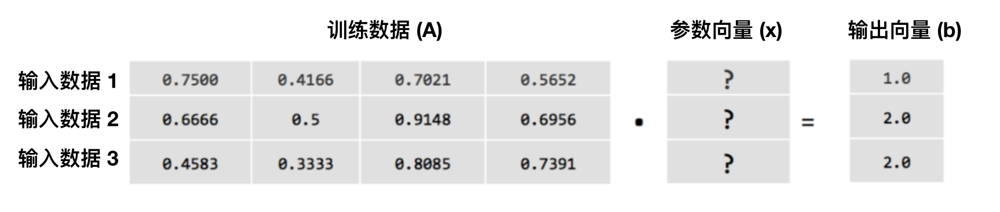

!SLIDE center subsection

# 机器学习回顾

本章复习机器学习重要概念.

!SLIDE

# 机器学习回顾

* 人工智能， 机器学习，深度学习与它们的关联性
* 线性代数
* 线性回归
* 模型选取
* 低度拟合与过度拟合

!SLIDE

# 人工智能， 机器学习，深度学习与它们的关联性

* 人工智能的一项分支是机器学习， 机器学习的一项分支是深度学习

!SLIDE

# 机器学习回顾

* 人工智能， 机器学习，深度学习与它们的关联性
* **&rArr;** 机器如何学习?
* 线性代数
* 线性回归
* 模型选取
* 低度拟合与过度拟合

!SLIDE

# 机器如何学习?

* 从数据分析中获得结构描述（structural descriptions), 并使用结构描述对未知数据进行预测
* 结构描述/模型有多种形式
  * 决策树
  * 线性模型
  * 神经网络
* 各模式应用不同的方式对原始数据进行训练

!SLIDE

# 机器如何学习?

!SLIDE

# 机器学习回顾

* 人工智能， 机器学习，深度学习与它们的关联性
* 机器如何学习?
* **&rArr;** 线性代数
* 线性回归
* 模型选取
* 低度拟合与过度拟合

!SLIDE

# 线性代数

* 纯量 (scalar)
  * 向量中的元素
  * 又称变量
* 向量 (vector)
  * 由元素所组成的数组
* 矩阵 (matrix)
  * 由向量排列成的矩形陣列，每行的元素数量需一致
* add pictures

!SLIDE

# 线性代数

* 张量 (tensor)
  * 多维数组
  * 秩(Rank)
    * 纯量的秩是0
    * 向量的秩是1
    * 矩阵的秩是2
    * 任何实体的秩是3及以上的都被视为张量。
* 超平面 (hyperplane)
  * 一个比于其周围空间维度小于一的子空间
  * 三维空间->维度为二的平面
  * 二维空间->维度为一的线
* add pictures

!SLIDE

# 将数据转换成矢量

* 数据需要以固定的格式输入
  * 文本
  * 时间序列数据 (天气预报, 视频)
  * 音频
  * 图像

!SLIDE

# 将数据转换成矢量

* 鸢尾数据集

* 文本文件

!SLIDE

# 将数据转换成向量

* 图像

!SLIDE

# 机器学习回顾

* 人工智能， 机器学习，深度学习与它们的关联性
* 机器如何学习?
* 深度学习
* 机器学习与深度学习的比较
* 线性代数
* **&rArr;** 线性回归
* 模型选取
* 低度拟合与过度拟合

!SLIDE

# 求解线性方程组 Ax = b

* 在线性代数里，想寻以下线性方程里的矩阵x

* A 矩阵
	* 输入数据组成的矩阵
* x 向量
	* 代表模型的参数矢量
* b 向量
	* 输出数据/标签组成的矩阵，与A矩阵的行数量一样

!SLIDE

# 求解线性方程组

* 两个方法
	* 直接法
	* 迭代法
* 直接法
	* 固定的计算回合给予答案
	* 数据需占据记忆
	* 例子：高斯消去法, 正规方程
* 迭代法
	* 经过一系列的步骤直到收敛
    * 随机梯度下降算法

!SLIDE

# 迭代法图释

!SLIDE

# 机器学习回顾

* 人工智能， 机器学习，深度学习与它们的关联性
* 机器如何学习?
* 线性代数
* 线性回归
* **&rArr;** 模型选取
* 低度拟合与过度拟合

!SLIDE

!SLIDE

# 机器学习回顾

* 人工智能， 机器学习，深度学习与它们的关联性
* 机器如何学习?
* 线性代数
* 线性回归
* 模型选取
* **&rArr;** 低度拟合与过度拟合

!SLIDE

# 低度拟合与过度拟合

* 低度拟合-模型太简单, 无法很好地描述训练数据
* 过度拟合-模型使用过多参数, 导致模型对训练数据过度拟合

~~~SECTION:notes~~~
https://docs.aws.amazon.com/zh_cn/machine-learning/latest/dg/model-fit-underfitting-vs-overfitting.html
过拟合是在统计模型中，由于使用的参数过多而导致模型对观测数据（训练数据）过度拟合，以至于用该模型来预测其他测试样本输出的时候与实际输出或者期望值相差很大的现象
~~~ENDSECTION~~~
