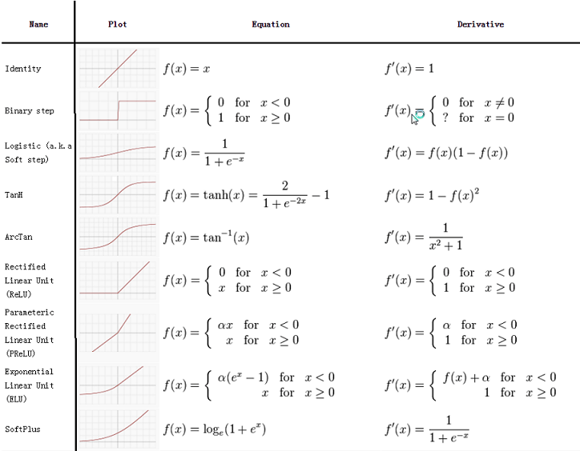

!SLIDE center subsection

# 激活函数

!SLIDE

# 什么是激活函数

* 根据输入确定神经元的输出
* 每神经元拥非线行传递函数
* 每层各别定义
* 使神经网络为特征做出复杂的边界决策

!SLIDE

# 激活函数

* 隐藏层
  * 控制发向连接神经元的信号
* 输出层
  * 决定输出值
    * 分群
    * 回归
    * 等等

!SLIDE

# 常用激活函数

* ReLU
  * 最近的突破
  * 作为缺省值
* Sigmoid
  * S 型 范围 0 到 1
  * 用于缺省值
* TanH
  * S 型 范围 -1 到 1

~~~SECTION:notes~~~
# Keep SImple Listing and move most to the appendix
~~~ENDSECTION~~~

!SLIDE

# 激活函数

!SLIDE

# 输出层激活函数

* 隐藏层激活函数是为了限制层间输出值
* 输出层激活函数是为了给予预测值
  * 分类 = Softmax 函数
  * 回归 = 恒等函数 （Identity)

~~~SECTION:notes~~~

Add One Hot Encoding discussion with Classification and SoftMax

~~~ENDSECTION~~~

!SLIDE

# 输出层指引

* 分类
  * Softmax 激活
    * 各类的概率分布
    * 输出值总结成1.0
  * 损失函数 - 负对数似然函数 （Negative Log Likelihood）
  * 多类交叉熵
* 回归
  * 恒等激活
  * 均方误差(MSE) 误差函数

!SLIDE

# 快速统计回顾: 概率

* 概率
  * 我们将一个事件E的概率定义为定义为在0和1之间的数字
	* 在这定义下， 数字0表示事件E不可能发生而数字1表示事件E肯定会发生
*  典型硬币示例
  * 当掷硬币时，获得正面或反面的概率是0.5
	* 样本空间的概率总结成1

!SLIDE

# 分类

* 预测結果是属于哪一种类别的方法
* 例子:
	* “这图片里的动物是猫或狗？”
	* 二元分类 - 当只有两个标签
	* Classes: { 猫, 狗 }， { T/F }
* 多元分类
	* N 个标签

!SLIDE

# 回归

* 从模型输出连续价值
* 例子: “预测明天最高温度”
	* 输出值: 75F
* 例子: "根据平方英尺预测房子的价格"
	* 输出值: $250,000.00

~~~SECTION:notes~~~

activation function for the output layer:
this is usually application specific.
For classification problems, you generally want to use the softmax activation function, combined with the negative log likelihood / MCXENT (multi-class cross entropy).

The softmax activation function gives you a probability distribution over classes (i.e., outputs sum to 1.0). For regression problems, the “identity” activation function is frequently a good choice, in conjunction with the MSE (mean squared error) loss function.

~~~ENDSECTION~~~
