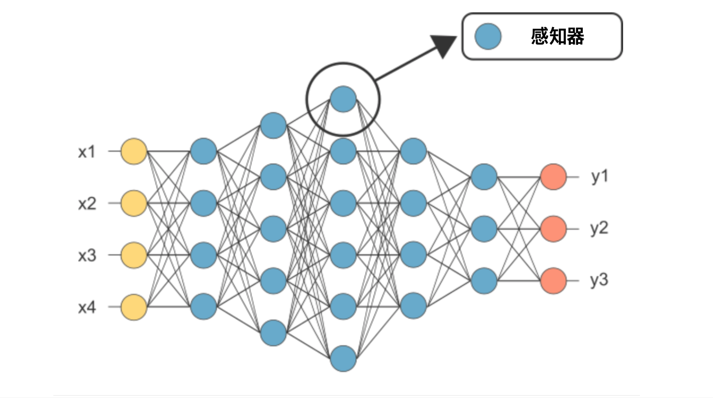
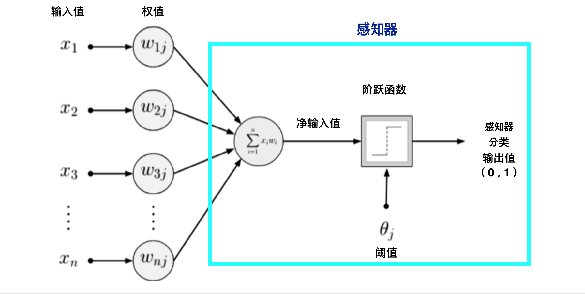
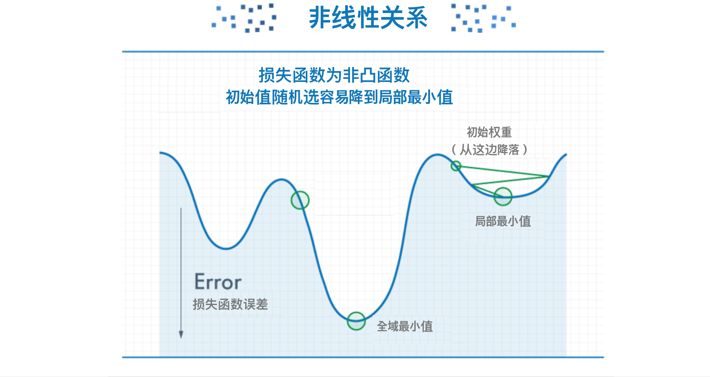

!SLIDE center subsection

# 神经网络，深度网络基础

本章介绍神经网络，深度网络重要概念.

!SLIDE

#神经网络，深度网络基础内容

* 人工智能， 机器学习，深度学习与它们的关联性
* 神经网络, 深度网络介绍
* 生物神经元启发
* 机器学习与深度学习的比较
* 感知器
* 深度网络架构
	* 参数
	* 层
	* 反向传播
	* 激活函数
	* 损失函数
	* 优化算法
	* 超参数

!SLIDE

# 人工智能， 机器学习，深度学习与它们的关联性

* 人工智能的一项分支是机器学习， 机器学习的一项分支是深度学习（类神经网络）

!SLIDE

# 机器学习与深度学习的比较

* 机器学习
  * 自标签特征
  * 需要咨询主题专家
  * 需要设置上下文

* 深度学习/神经网络
  * 自动的特征工程(Feature Engineering)-通过启发式的方法选取特征集合,构造向量
  * 自动学习上下文

!SLIDE

# Ax = b

* 在神经网络里
	* 矩阵A仍是输入样本
	* 向量b仍是输入样本
	* 而参数向量x则是神经网络的权值

* 神经网络, 深度网络是非线性模型
* 非线性函数使得能解决复杂问题

!SLIDE

# 神经网络，深度网络基础内容

* 神经网络, 深度网络介绍
* **&rArr;** 生物神经元启发
* 感知器
* 深度网络架构
	* 参数
	* 层
	* 反向传播
	* 激活函数
	* 损失函数
	* 优化算法
		* 梯度下降法，随机梯度下降法
		* 梯度消失， 梯度爆炸
	* 超参数

!SLIDE

# 生物神经元启发

!SLIDE

# 神经网络启发

* 1980年代，美国神经生物学家David Hubel和Torsten Wiesel对于动物视觉系统的处理信息方式有突破

!SLIDE

# 多层神经网络拓扑

* 当称n层神经网络时，输入层是不计算的

!SLIDE

# 神经网络与深度网络的关联

* 深度网络
	* 比神经网络更多神经元
	* 以更复杂的方法连接层与层
	* 需要更多的计算能力来训练
	* 自动特征提取

!SLIDE

# 神经网络，深度网络基础内容

* 神经网络, 深度网络介绍
* 生物神经元启发
* **&rArr;** 感知器
* 深度网络架构
	* 参数
	* 层
	* 反向传播
	* 激活函数
	* 损失函数
	* 优化算法
	* 超参数

!SLIDE

# 感知器

* 关于生物大脑神经传递的研究启发了AI领域【人工神经网络】的概念
* 感知器是用于二元分类的线性模型
* 在神经网络领域里，感知器是以阶跃函数为激活函数的人工神经元

!SLIDE

# 感知器

!SLIDE

# 感知器

!SLIDE

# 神经网络，深度网络基础内容

* 神经网络, 深度网络介绍
* 生物神经元启发
* 感知器
* **&rArr;** 深度网络架构
	* 参数
	* 层
	* 激活函数
	* 反向传播
	* 损失函数
	* 优化算法
	* 超参数

!SLIDE

# 深度网络架构

* 正向传播 （forward propagation)
	* 把输入向量从左到右传递， 产出预测结果

!SLIDE

# 参数

* x列向量是参数向量
* 神经网络中的参数直接关系到网络中连接性
* 通过训练深度网络以调整参数值（权重与偏差值）

!SLIDE

# 层

* 深层网络中的基础架构单元
* 输入层：把输入数据输入网络
* 隐藏层：让神经网络对非线性函数进行建模
* 输出层：从输出层获取模型预测的

!SLIDE

# 激活函数

* 把感知器的输出值压缩到一定范围，并向前传播
* 采取单数字，并对其进行某种固定的数学运算

* 使深度网络属非线性

!SLIDE

# 激活函数

* 更多激活函数例子

!SLIDE

# 反向傳播算法

* 训练深度网络的算法
* 反复的将误差讯号传播回去，对每一个神经元都往正确的方向调整参数值

!SLIDE

# 损失函数

* 预测結果和真实結果之間的差距
* 将训练神经网络定义为优化问题
	* 也就是：如何找到优化的最佳解（误差的最小值）

!SLIDE

# 损失函数

!SLIDE

# 优化算法

* 可把训练深度网络视为优化问题
* 将损失函数最小化
* 而其参数向量值将最似的代表网络模型（優化的最佳解）
* 如何在下个迭代步骤里更改x参数向量

!SLIDE

# 优化算法

* 最典型的方法是采用随机梯度下降法(Stochastic Gradient Descent)
* 也就是计算预测结果和实际真实数据之間的距离差距

!SLIDE

# 线性问题复习

* 將损失函数的公式J(Ө)画出來，能发现是一個凸函數
* 可以想像我們將一顆球從最高點開始滾落、很快就能掉到這個山谷的谷底 (最小值)。（delete this later)， 就是說，在面對線性問題時，模型能夠很快地找到代價函數的最小值。

!SLIDE

# 优化算法

* 深度网络属非线性问题
* 其损失函数J(Ө)不是凸函數， 并有多個局部最小值。

!SLIDEs

# 优化算法
* 陷入局部最小值是多层神经网络
* 随着层数的增加， 非凸的代价函数越来越复杂，局部最小值点成倍增长
* 初始值设置很重要

!SLIDE

# 优化算法

* 梯度下降算法 - 透过微积分计算出斜率 (导数)，我們可以计算出山坡上最陡峭的方向，往反方向下降
* 随机梯度下降算法 - 随机选择一个斜率為初始值，然后不断地修改以减小，直到斜率為0

!SLIDE

# 梯度消失，梯度爆炸

* 梯度消失
	* 非线性问题的损失函数为非凸函数，求解时容易陷入局部最优解
	* 随着梯度逐层不断消散， 导致其对神经元权重调整的的功用越來越小
* 梯度爆炸
	* 梯度会随着反向传播层数的增加而呈指数增长，导致梯度爆炸

!SLIDE

# 梯度消失，梯度爆炸

* 简单的初始化和激发函数的调整有效解决梯度消失，梯度爆炸的问题

!SLIDE

# 超参数

学习速率(learning rate)

* 沿梯度方向的步长的大小

!SLIDE

# 超参数

学习速率(learning rate)

* 学习速率值小： 进展平稳但缓慢
* 学习速率值高： 进步更快但陷入局部最小值的风险更大

!SLIDE

# 测验

* 随机梯度下降是以下那个例子
	* A. 优化算法
	* B. 激活函数
	* C. 损失函数

!SLIDE
