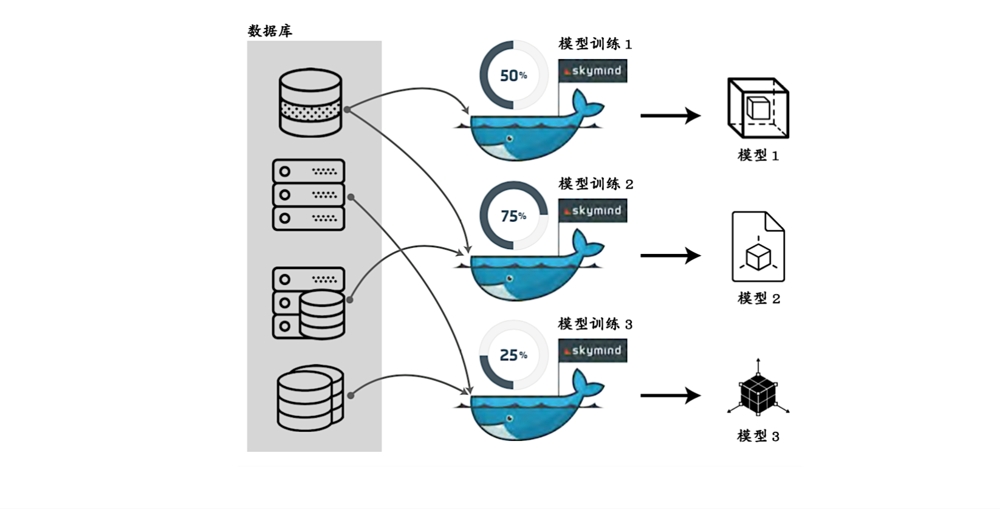

!SLIDE center subsection

# SKIL简介

本章节介绍Skymind智能层-SKIL

!SLIDE

#SKIL(Skymind Intelligence Layer)

* 全世界首个深度学习操作系统
* 将数据科学项目快速简便地投入生产
* 包含生产中部署 Deeplearning4j、供应商集成、专有组件和开源组件所必需的全部组件及依赖项

!SLIDE

#导入Python模型

* SKIL将Keras作为其Python 的接口，让用户可以通过Keras把Python模型导入到SKIL
* 数据科学家可以导入以下 的Python模型:
  * TensorFlow, Caffe/ Caffe 2, MXNEet, CNTK, Theano, Torch

!SLIDE

for own reference dlete later
Lightbend的快速数据平台是结合Apache Kafka、Apache Spark、 Mesosphere DC/OS、OpsClarity、Apache Flink、Skymind SKIL和 Lightbend Reactive Platform，包括Akka，Akka Streams以及Play和 Lagom框架。快速数据平台也为了针对各种部署场景进行了调整、安装、整 合、以及一些预设好的应用程序来帮助用户设置他们的应用场景。
SKIL在快速数据平台扮演“大脑”的角色，并将人工智能与大数据分析工作流 程相互融合。
对大部分企业来说，面对人工智能技术，最大的障碍在于大数据、商业智能， 以及其他分析工具和技术之间严重的隔阂。而通过SKIL可以将人工智能带入主 流分析工作，驾驭人工智能的强大威力。SKIL与Lightbend 在快速数据平台上 的合作就是最佳的案例之一。

!SLIDE

# SKIL架构

!SLIDE

# SKIL优势

* 让算法工程师和数据科学家方便地进行模型训练、评估及预测，同时还可以快速的把模型发布到生产环境
* 拥有简洁，简单操作的可视化界面

!SLIDE

# SKIL功能: WEB笔记本

* 内置WEB笔记本提供交互数据分析，数据可视化等功能

!SLIDE

# SKIL功能: 桌面功能

* 让用户根据需求来设置训练、运行或生产配置

!SLIDE

# SKIL功能: 多模型并行训练

* 使用多台机器同时训练多种模型, 有效的进行实验

!SLIDE

# SKIL功能: 自动硬件优化

* SKIL优化CPU、GPU和其他专业化硬件的常规深度学习的计算量
* 用户可以部署深度学习应用程序，无须担心资源与速度的限制。

