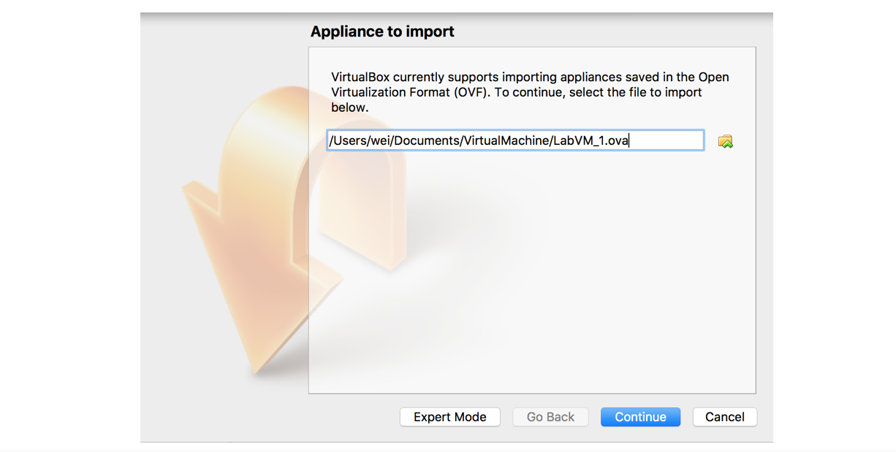

!SLIDE

# 欢迎来到2天的培训课程

* 深度学习平台介绍

!SLIDE

# 时程表

* 9:00 AM 开始
* 每 50 分钟休息 10 分钟

!SLIDE

# 介绍内容

* Skymind简介
* 开源库系列
* 深度学习教科书
* 讲师介绍
* 虚拟器安装

!SLIDE

# Skymind简介

!SLIDE

# 我们的工程师分布在全球各地

!SLIDE

# 开源库系列

* 核心组件是我们的整个开源库系列
* Deeplearning4j、ND4J、RL4J、DataVec、 Arbiter、JavaCPP和LibND4J等，涵盖了构建深度学习应用所需的全部要素

!SLIDE

# 开源库系列

* 核心组件是我们的整个开源库系列
* Deeplearning4j、ND4J、RL4J、DataVec、 Arbiter、JavaCPP和LibND4J等，涵盖了构建深度学习应用所需的全部要素

!SLIDE

# 深度学习教科书

* Deep Learning A Practitioner's Approach

!SLIDE

# 讲师介绍

!SLIDE

# 讲师介绍

!SLIDE

# 虚拟器安装（实习用途）

* https://www.virtualbox.org/wiki/Downloads

!SLIDE

# 导入操作系统映像

* skil, dl4j-examples, intellij, java, maven

!SLIDE

# 培训内容
* Skymind介绍
* 机器学习回顾
* 神经网络，深度网络基础
* Deeplearning4j架构
* SKIL简介
* 前馈神经网络
* YOLO理论知识

!SLIDE

# 培训内容
* CNN 理论知识
* MNIST 案例演示
* 计算图的实际应用
* RNN的理论知识
* RNN的案例演示
* LSTM 理论知识
* LSTM 理论知识
* VAE 理论知识
* VAE 案例演示

!SLIDE
