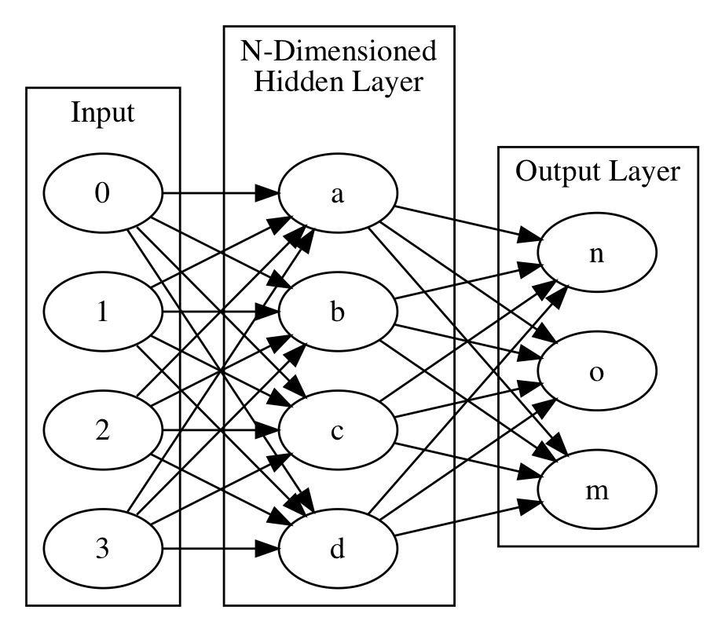

!SLIDE center subsection

# 什么是深度神经网络

本章节介绍人工智能， 机器学习，深度学习与它们的关联性。

!SLIDE

# 什么是深度神经网络

深度学习与机器学习的关系

* 机器学习
* 数据科学 / 数据挖掘
* 深度学习

!SLIDE

# 机器学习

* **&rArr;** 机器学习
* 数据科学 / 数据挖掘
* 深度学习

!SLIDE

# 机器学习

* 从数据中自动分析获得规律，并利用规律对未知数据进行预测的算法

!SLIDE

# 机器学习

* 模型的形式从原始数据中提取知识
  * 决策树
  * 线性模型
  * 神经网络

* Arthur Samuel 引用句:
  * "不需明确编程下给予计算机学习能力的领域"

!SLIDE

# 机器学习, 数据挖掘与深度学习的关联性

!SLIDE

# 数据科学 / 数据挖掘

* 机器学习
* **&rArr;** 数据科学 / 数据挖掘
* 深度学习

!SLIDE

# 数据科学/数据挖掘
* 数据挖掘
    * 从数据中提取信息的过程
    * 应用机器学习
* 数据科学
  * 利用数据学习知识的学科
  * 通过从数据中提取出有价值的部分来生产数据产品

!SLIDE

# 深度学习

* 机器学习
* 数据科学 / 数据挖掘
* **&rArr;** 深度学习

!SLIDE

# 深度学习

* 深度学习是机器学习的分支，是一种试图使用包含复杂结构或由多重非线性变换构成的多个处理层对数据进行高层抽象的算法

来源 - 维基百科

!SLIDE

# 神经网络

* 应用类似于大脑神经突触联接的结构进行信息处理的数学模型

!SLIDE

# 神经网络与机器学习的比较

* 机器学习
  * 自标签特征
  * 需要咨询主题专家
  * 需要设置上下文
* 深度学习/神经网络
  * 自动的特征工程(Feature Engineering)-通过启发式的方法选取特征集合,构造向量
  * 自动学习上下文

!SLIDE
# 生物神经元

* 生物神经元: 大脑处理信息的基本单元，通过释放化学物质处理和传输信息
* 生物神经网络: 从生物的神经元、细胞、触点等组成的网络

~~~SECTION:notes~~~

Add Picture

~~~ENDSECTION~~~

!SLIDE

# 人工神经网络的作用

* 学习或训练模型以便执行在传统编程方面具有挑战性的任务。
  * 语音识别
  * 物体识别
  * 电脑视觉
  * 模式识别

!SLIDE

# 监督学习于非监督学习

* 监督学习
  * 对每个训练数据给予自定义标签
  * 模型学习输入数据与标签的关联
* 非监督学习
  * 不需要人力来输入标签
  * 模型从数据的结构进行聚类
* 神经网络可以用于监督学习或无监督学习

!SLIDE

# 聚类

* 非监督学习
	* K-means聚类算法
* 例子
	* “将k组类似的新闻报导聚类在一起”
* ND4J 支持这个, 可是它不是神经网络

!SLIDE

# 神经网络

