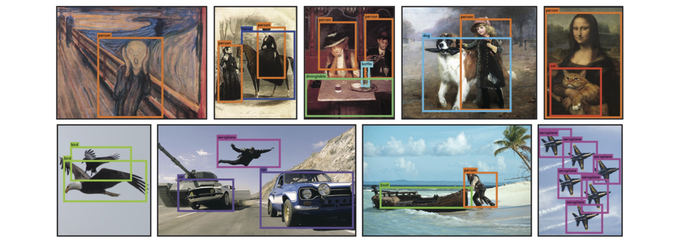

!SLIDE center subsection

# YOLO理论知识

本章节描述YOLO目标检测算法

!SLIDE

# YOLO理论知识

* 背景陈述
* YOLO概观,架构
* YOLO优点
* YOLO缺点
* YOLO图像结果

!SLIDE

# 背景陈述

* CNN速度慢，计算成本高

!SLIDE

# 背景陈述

* 分类问题-从图像中预测出目标类型

!SLIDE

# 背景陈述

* 当图像中出现多个目标时如何处理？

!SLIDE

# 背景陈述

* 目标检测 = 分类 + 目标定位

!SLIDE

# YOLO概观,架构

* You Only Look Once
* 最先进(state of the art), 实时目标检测算法
* 将目标检测视为回归问题

!SLIDE

# YOLO概观,架构

* 利用整张图作为网络的输入
* 图像像素 -> bounding box的位置和bounding box所属的类别。
  * 预测(x, y, w, h)和confidence共5个值

!SLIDE

# YOLO概观,架构

* 图像中的多个目标同时被检测
* 非极大值抑制(Non-maximum Suppression)用于定位目标

!SLIDE

# YOLO概观,架构

* 非极大值抑制(Non-maximum Suppression)

!SLIDE

# YOLO概观,架构

!SLIDE

# YOLO优点

* 1. 实时处理(448 x 448 输入图像, 45帧每秒)
  * 无特征提取
  * 不使用滑动窗口技术
  * 不预先预测前景区域与背景区域(Region Proposal Network)

!SLIDE

# YOLO优点

!SLIDE

# YOLO优点

* 2. 泛化能力强
  * YOLO在培训和测试期间输入整张图像， 让目标的上下文信息(contextual information)得于保存
* 3. 架构适于优化 （因为整个目标检测管道是个单一的网络）

!SLIDE

# YOLO缺点

* Localization Error定位错误高 - 对相互靠很近的物体，还有很小的群体, 检测效果不好
  * 例子： 一群鸟

!SLIDE

# YOLO图像结果

* 人错误的被预测成飞机

!SLIDE
