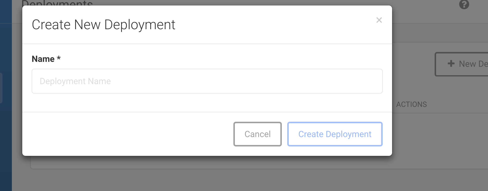
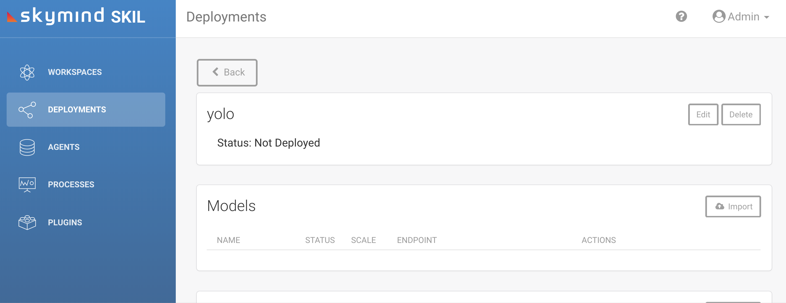
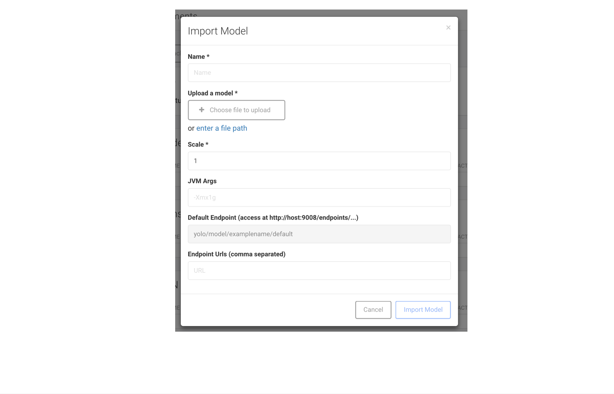
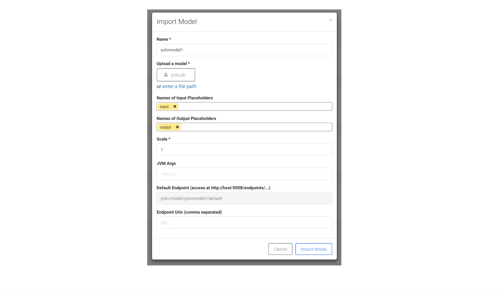
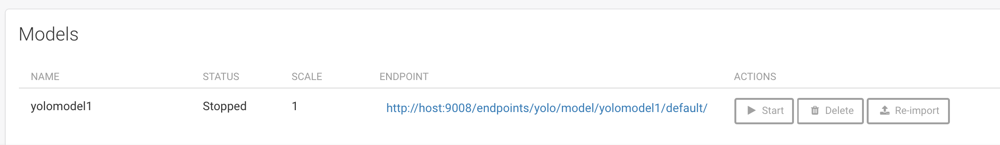
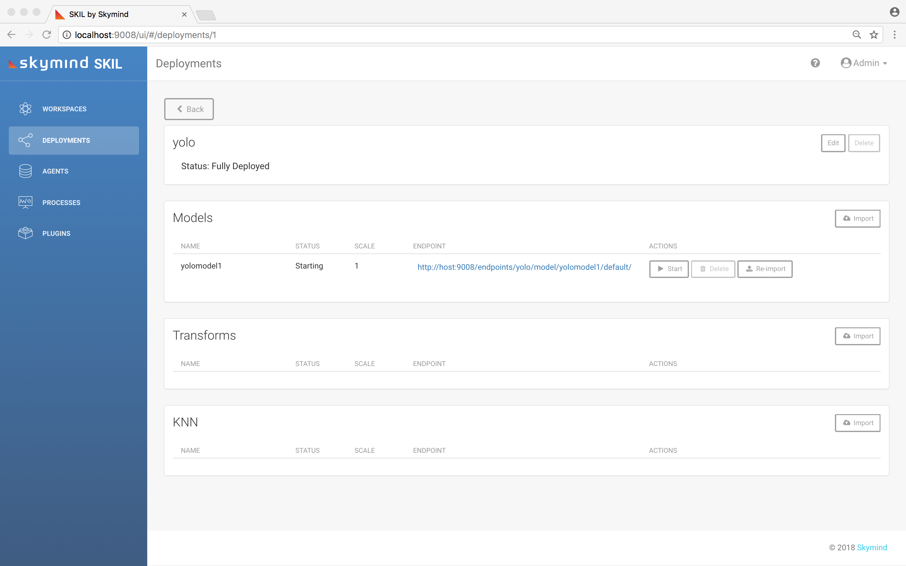
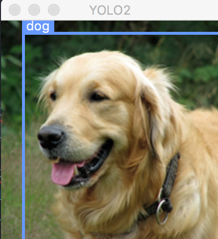

!SLIDE center subsection

# Tensorflow模型导入SKIL

!SLIDE

# Tensorflow frozen model file

* http://wm-eddie.info/pub/yolo.zip

!SLIDE

# Create new deployment

!SLIDE

# Click deployments on the left

!SLIDE

# Models -> import

!SLIDE

# Add names - input, output

!SLIDE

# Start the model

!SLIDE

# Check the status : Fully Deployed

!SLIDE

# Test yolo on an image

* cd /home/osboxes/SKIL_Examples/skil_yolo2_app/client_app

* java -jar ./target/skil-example-yolo2-tf-1.0.0.jar --input file:///Users/wei/Desktop/goldenretriever.jpg --endpoint http://localhost:9008/endpoints/yolo/model/yolomodel1/default/

* java -jar ./target/skil-example-yolo2-tf-1.0.0.jar --input https://raw.githubusercontent.com/tejaslodaya/car-detection-yolo/master/images/0012.jpg --endpoint http://localhost:9008/endpoints/yolo/model/yolomodel1/default/

!SLIDE

!SLIDE
