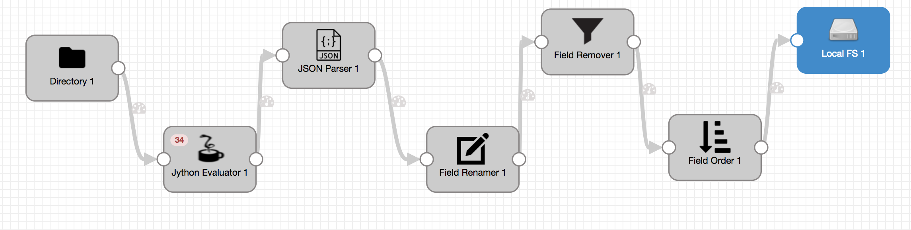
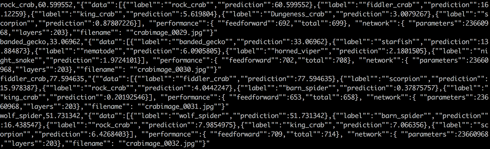

!SLIDE 


!SLIDE transition=fade

# Using Streamsets and DL4J to Build an Image Classification Pipeline 

* Streamsets to ingest directory of images
* Trained Neural Network to classify images

!SLIDE  transition=fade

# About Skymind

* Company behind DeepLearning4J
* DeepLearning in Java
* Apache Licensed
* Easy to use
* Enterprise Focus

!SLIDE  transition=fade

# About Streamsets


* Streamsets Data Collector
  * Deployed on cluster or cloud
  * Moves Data from source to destination 
  * Smart Pipelines

!SLIDE

# Overview of the Demo

* Image Classifier
* Inception Convolutional Network
* Trained on ImageNet Challenge
* 1000 Labels, returns top 5

!SLIDE  transition=fade

# Example of Classifier

* Given this image


!SLIDE  transition=fade

# Returned Data


```
{"data":[{"label":"tabby","prediction":56.643772},{"label":"tiger_cat","prediction":10.006461},{"label":"Egyptian_cat","prediction":4.3665657},{"label":"sleeping_bag","prediction":2.96964},{"label":"bath_towel","prediction":1.076501}], "performance":{ "feedforward":718,"total":806}, "network":{ "parameters":23660968,"layers":203},"filename": "fergus - 23.jpg"}
```

!SLIDE  transition=fade

# Classifier built in DL4J

* Neural Network
  * Pre-trained weights
  * Imported from Keras
* Web Interface
  * Takes image input
  * Returns JSON text
  
!SLIDE  transition=fade

# Streamsets Pipeline

* Reads Directory of images
* Ships to Classifier Web App
* Gathers output and writes to Disk

!SLIDE  transition=fade

# Image of Pipeline




!SLIDE  transition=fade

# Screenshot of output




!SLIDE  transition=fade

# Performance

* One Image per Second
* Hardware
  * Azure Instance
  * D8s v3 (8 vcpus, 32 GB memory)
  * About $300/month
  
!SLIDE  transition=fade

# Deployment Options

* Java
  * Hadoop
  * Spark
  * Standalone
  * SKIL
