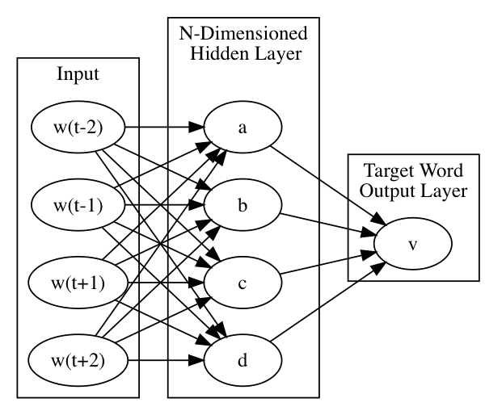

!SLIDE center subsection

# Data Ingestion Case Study: Text　データ取り込み事例:テキスト

!SLIDE

# Table of Contents　目次

* PreProcessing and tokenization　事前処理とトークン化
* Bag of Words　単語の袋（Bag of Words）
* N-Grams　エヌグラム（N-Grams）
* Word2Vec
* Paragraph Vectors　段落ベクトル
* GloVE　グローバルベクトル
* Words as Sequence of Characters　文字列としての単語

!SLIDE
# Table of Contents　目次

* **&rArr;** PreProcessing and tokenization　事前処理とトークン化
* Bag of Words　言葉の袋
* N-Grams　エヌグラム（N-Grams）
* Word2Vec
* Paragraph Vectors　段落ベクトル
* GloVE　グローバルベクトル
* Words as Sequence of Characters　文字列としての単語

!SLIDE

# PreProcessing and Tokenization　事前処理とトークン化

* Tokenizer　トークナイザ
	* Splits stream of words into individual words　単語ストリームを個々の単語に分割
	  * DefaultTokenizer
	  * NGramTokenizer 
  	  * PosUimaTokenizer
	  * UimaTokenizer
* PreProcessors　事前プロセッサ
  * LowCasePreProcessor
  * StemmingPreprocessor

!SLIDE

# Table of Contents　目次

* PreProcessing and tokenization　事前処理とトークン化
* **&rArr;** Bag of Words　言葉の袋
* N-Grams　エヌグラム（N-Grams）
* Word2Vec
* Paragraph Vectors　段落ベクトル
* GloVE　グローバルベクトル
* Words as Sequence of Characters　文字列としての単語

!SLIDE

# Bag of Words言葉の袋

Corpus is represented as the bag(multiset) of its words.　コーパスはその単語の袋（複数セット）として表現される

* No Grammar　文法なし
* No order　順番なし
* Frequency only　頻度のみ

"Bob and Carol and Ted and Alice"　

Becomes the List　がリストになり、
["Bob","and","Carol","Ted","Alice"]　"ボブとキャロルとテッドとアリス"

Term frequency　単語の頻度
 [1,3,1,1,1] 

!SLIDE

# Bag of Words Uses　単語の袋の使用方法

* TfIDF
  * Frequency of word/document compared to word/corpus of documents　文書の単語・コーパスと比較した単語・文書の頻度
TfIDF

!SLIDE

# Bag of Words Example　単語の袋の事例

* Lab folder has example演習フォルダに例がある
* Tokenizer to read files from directory and label with filename　トークナイザはディレクトリからファイルを読み込み、filenameでラベル付け
Lab　演習

		TokenizerFactory tokenizerFactory = new DefaultTokenizerFactory();
        LabelAwareIterator iterator = new FilenamesLabelAwareIterator
		.Builder()
                .addSourceFolder(new ClassPathResource("bow").getFile())
                .useAbsolutePathAsLabel(false)
                .build();
				

!SLIDE

# Bag of Words Example .....　言葉の袋の事例（続き）

* Code to show contents of iterator　イテレータの内容を表示するコード

		
		while(iterator.hasNext()){
            LabelledDocument doc = iterator.nextDocument();
            System.out.println(doc.getContent());
            System.out.println(doc.getLabels().get(0));
        }

        iterator.reset();

!SLIDE

# Bag of Words Example ..... 言葉の袋の事例（続き）

	BagOfWordsVectorizer vectorizer = new BagOfWordsVectorizer.Builder()
                .setMinWordFrequency(1)
                .setStopWords(new ArrayList<String>())
                .setTokenizerFactory(tokenizerFactory)
                .setIterator(iterator)
                .build();
	vectorizer.fit();
			

!SLIDE

# Bag of Words Example ..... 言葉の袋の事例（続き）

* Code to explore the contents of the Bag of Words　言葉の袋のコンテンツのコード

		log.info(vectorizer.getVocabCache().tokens().toString());
		System.out.println(vectorizer.getVocabCache().totalNumberOfDocs());
		System.out.println(vectorizer.getVocabCache().docAppearedIn("two."));
		System.out.println(vectorizer.getVocabCache().docAppearedIn("one."));
		System.out.println(vectorizer.getVocabCache().docAppearedIn("world"));

!SLIDE

# Table of Contents　目次

* PreProcessing and tokenization　事前処理とトークン化
* Bag of Words　言葉の袋
* **&rArr;** N-Gramsエヌグラム（N-Grams）
* Word2Vec
* Paragraph Vectors　段落ベクトル
* GloVE　グローバルベクトル
* Words as Sequence of Characters　文字列としての単語

!SLIDE

# NGrams 

* Contiguous sequence of n items from a sequence of text　テキスト列からのn文字の連続配列
* Example text ***"It is the year 2016"***　テキスト例
  * Extracted Bi-grams 　バイグラム抽出
	* "It is" 
	* "is the" 
	* "the year" 
	* "year 2016"
  * Extracted Tri-grams　トライグラム抽出
	* "It is the" 
	* "is the year" 
	* "the year 2016"

!SLIDE

# NGram uses　 NGramの使用方法

* Provide more context than Bag of Words　言葉の袋よりも多くのコンテキストを提供
* Used in some neural networks for speech recognition to narrow the scope of prediction　予測範囲を狭めるため、言語認識用のニューラルネットワークに使用されることがある
  * RNN predicts next word out of top x percent of trigram for previous 2 word predictions　RNNは、トライグラムによって最初の2単語から3つ目の単語をx %予測

!SLIDE

# Code Example: NGrams in DL4J　コード例: DL4JにおけるNGrams

	public static void main(String[] args) throws Exception{
        String toTokenize = "To boldly go where no one has gone before.";
        TokenizerFactory factory = 
		new NGramTokenizerFactory(new DefaultTokenizerFactory(), 1, 2);
        
		Tokenizer tokenizer = factory.create(toTokenize);
        factory = new NGramTokenizerFactory
		(new DefaultTokenizerFactory(), 2, 3);
		
        List<String> tokens = factory.create(toTokenize).getTokens();
        log.info(tokens.toString());

Output　出力

	[To, boldly],  [boldly, go],  [go, where],......
	[To, boldly, go],  [boldly, go, where] ......

!SLIDE

# Table of Contents　目次

* PreProcessing and tokenization　事前処理とトークン化
* Bag of Words　言葉の袋
* N-Grams　エヌグラム（N-Grams）
* **&rArr;** Word2Vec
* Paragraph Vectors　段落ベクトル
* GloVE　グローバルベクトル
* Words as Sequence of Characters　文字列としての単語

!SLIDE

# Word2Vec　

* Model for word embeddings　単語の分散表現のモデル
* Vector Space　ベクトル空間
* Each word in corpus => vector in multi-dimensional vector space　コーパスの各単語の意味=>多次元のベクトル空間にあるベクトル
* Relative location of word in vector space denotes relationship　ベクトル空間の単語間の相対的位置が関係性を表現
	* Distance and direction from Boy->Man　 少年->男性への距離と方向
	* Distance and Direction from Girl->Woman　少女->女性への距離と方向

!SLIDE

# Word2Vec - Generating the Vector Space　ベクトルの生成

* Neural Network trained to return word probabilities of a moving window　確率に基づいて単語を返すようにニューラルネットワークを訓練する（移動ウインドウ式）
	* Given word "Paris", out of the corpus of words predict probility of each word occuring within say five words of the word "Paris"　「Paris」（パリ）という単語をコーパスとする場合、その5語以内に各語が出現する確率を予測
* One hot Vector, size of every word in the corpus　 ワンホットベクトル、コーパス内のすべての単語のサイズ
* all 0's except for 1 representing the word　該当単語を表す1以外、すべてが0
* See Demo https://ronxin.github.io/wevi/　デモを見るhttps://ronxin.github.io/wevi/
* See example in intellij　intellijの例を参照
* Allows you to do word math　単語の演算ができるもの
	* King - Man + Woman = (?) Queen　王－男性＋女性＝女王（？）
	

!SLIDE

# One-hot encoding　ワンホット・エンコーディング

* Vector, the size of the vocabulary, all 0 except for single 1　ベクトル、語彙のサイズ、1が一つだけでそれ以外はすべて0

~~~SECTION:notes~~~

# Move to the datavec section, explain one-hot

~~~ENDSECTION~~~

!SLIDE

# Two Methods for Building word2vec　 Word2vec構築の二手法

* CBOW
  * w1,w2,w4,w5 as input to neural network　 w1、w2、w4、w5をニューラルネットワークへ入力
	  * Context words　コンテキスト（前後の）単語
  * Train net with w3 as target 　W3をターゲットにニューラルネットを訓練
	  * Focus word　フォーカス単語
* SKIP GRAM
  * Reverse of CBOW　CBOWの逆
  * Input is focus word　フォーカス単語を入力
  * Output is context words　コンテキスト単語を出力

!SLIDE

# CBOW visually　視覚化したCBOW

!SLIDE

# CBOW visually　視覚化したCBOW

!SLIDE

# CBOW visually　視覚化したCBOW

!SLIDE

# Table of Contents　目次

* PreProcessing and tokenization　事前処理とトークン化
* Bag of Words　言葉の袋
* N-Grams　エヌグラム（N-Grams）
* Word2Vec　
* **&rArr;** Paragraph Vectors　段落ベクトル
* GloVE　グローバルベクトル
* Words as Sequence of Characters　文字列としての単語

!SLIDE

# Paragraph Vectors/doc2Vec　段落ベクトル

* Extension to Word2Vec 　Word2Vecの拡張
  * Word2Vec associates words with words　Word2Vecは単語同士を関連付け
  * doc2vec has additional label　doc2vecは追加ラベルを持つ
  * Useful for sentiment analysis　感情（センチメント）分析に役立つ

!SLIDE

# Table of Contents　目次

* Bag of Words　言葉の袋
* N-Grams　エヌグラム（N-Grams）
* Word2Vec　
* Paragraph Vectors　段落ベクトル
* **&rArr;**  GloVE　グローバルベクトル
* Words as Sequence of Characters　文字列としての単語

!SLIDE

# GloVE　グローバルベクトル

* Vector Representation of words obtained from unsupervised word-word co-occurance　教師なしの単語間の共起により得られた単語のベクトル表現
* Pretrained vectors available　事前訓練されたベクトルが入手可
  * Wikipedia
  * Twitter

* 

!SLIDE

# Table of Contents　目次

* PreProcessing and tokenization　事前処理とトークン化
* Bag of Words　言葉の袋
* N-Grams　エヌグラム（N-Grams）
* Word2Vec　
* Paragraph Vectors　段落ベクトル
* GloVE　グローバルベクトル
* **&rArr;**  Words as Sequence of Characters　文字列としての単語

!SLIDE

# Text as Sequence of Characters　文字列としてのテキスト

Text can be treated as sequence of characters; neural networks can be trained to answer the question "Given input character X predict the next character"; then repeat.　テキストは文字列として扱うことができる。ニューラルネットワークは訓練して「入力文字Xの次の文字を予測せよ」という質問の答えを出し、これを 繰り返すことができる。

~~~SECTION:notes~~~

## Steal Andrey Karpathy blog pic

~~~ENDSECTION~~~

!SLIDE

# Character vs Word as Unit of Analysis　分析単位としての文字vs単語

* How many words are there?　単語数はいくつか？
* How many characters are there?　文字数はいくつか？
* Text->word processing is hard　 テキスト->ワードプロセッシングへの変換は難しい
  * prefix, suffix, etc　接頭辞、接尾辞など
  * "old school" , "New York" 　

!SLIDE

# Sequence of Characters as SubTree in Tree of All Character Strings　すべての文字列ツリーの下位の文字列ツリー

Graph of 　グラフ
test branch teste, testi, branch tested, branch testing

In an Recurrent Neural Network(Graves LSTM) each node is a hidden state vector　再帰型ニューラルネットワーク（Graves LSTM）では、各ノードは隠れ状態のベクトルである

!SLIDE

# Using Recurrent Neural Networks to Write Weather Forecast　再帰型ニューラルネットワークを使って天気予報を書く

After the content that describes LSTM RNN in detail we will have a lab that builds a neural network to generate characters one character at a time from a learned corpus.　LSTM RNNを詳細に記述したコンテンツの説明後、学習したコーパスから一度に1文字を生成するニューラルネットワークを構築する演習へ続く

In the lab we will train the network weather forecasts.　演習では天気予報に関してネットワークを訓練する

***Instructor note, foreshadow the lab , do not start the lab yet, next chapter ***

!SLIDE

