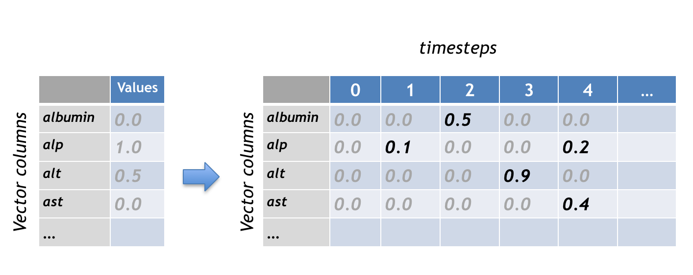
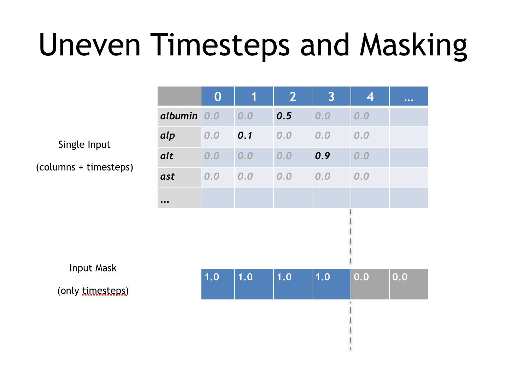

!SLIDE center subsection

# Introduction to Recurrent Neural Networks 　再帰型ニューラルネットワーク

* Overview　概要
* Benefits　利点
* Modeling Sequences　系列のモデリング
* Details　詳細
* BackPropagation through time　通時的誤差逆伝播法
* Tuning Guidelines　調整のガイドライン
* PhysioNet Example　 PhysioNet事例

!SLIDE

# Table of Contents　目次

* **&rArr;** Overview　概要
* Benefits　利点
* Modeling Sequences　系列のモデリング
* Details　詳細
* BackPropagation through time　通時的誤差逆伝播法
* Tuning Guidelines　調整のガイドライン
* PhysioNet Example　 PhysioNet事例

!SLIDE

# What is a Recurrent Neural Network?　再帰型ニューラルネットワークとは

* FeedForward Network with hidden state　隠れ状態のある順伝播型ネットワーク
* Hidden state with own internal dynamics　独自の内部動作を行う隠れ状態
* Information can be stored in "hidden state" for a long time　「隠れ状態」で情報を長期間保存できる

***In this section when we refer to RNN we mean Graves LSTM as defined here https://arxiv.org/abs/1308.0850***　本セクションではRNNとはGraves LSTMを指す（リンクを参照）。https://arxiv.org/abs/1308.0850***

!SLIDE

# Long Short Term Memory RNNs Uses　 LSTM RNNの使用方法

* Hand Writing Recognition　手書きの筆跡認識
* Sequence/Time Series Data　系列/時系列データ
* Sequence Generation　系列の生成
* Sequence Classification　系列分類

!SLIDE

# Long Short Term Memory RNN's　LSTM RNN

* Consider dynamic state of NN as Short term　ニューラルネットワークの動的状態を短期的に捉える
* We want to make that last a long time(Improve upon Vanilla RNN)　それを長期にわたって持続させたい（Vanilla RNN改善）
* Create modules that allow information to　情報を以下のようにできるモジュールを開発したい
  * Gate in　ゲートイン
  * Gate out when needed　必要に応じてゲートアウト
  * In between gate is closed and information is preserved　その間ゲートは閉じて情報が保存される
  * Forget Gate　忘却ゲート

~~~SECTION:notes~~~

# Steal pictures from dave　デイブから写真を盗む

~~~ENDSECTION~~~

!SLIDE

# Long Short Term Memory RNN's　 LSTM RNN

* Logistic write gate with each node in Recurrent Layer　再帰型ネットの層に各ノードを持つロジスティクス書き込みゲート
* Write Gate　書き込みゲート
  * ON/OFF state determined by rest of the network　残りのネットワークがオン/オフ状態を決める
  * Write State=ON　書き込み状態= ON
	* State is saved　状態を保存
* Keep Gate　キープゲート
  * On/OFF state determined by rest of the Network　残りのネットワークがオン/オフ状態を決める
  * Keep Gate=ON　キープゲート= ON
	* State is maintained　状態をキープ
* Read Gate　リードゲート
  * On/Off State Determined by rest of network　残りのニューラルネットによってオン/オフ状態が決まる
  * Read Gate ON　リードゲート= ON
	* Data in cell is output to network　セル内のデータはネットワークに出力される
* Data in the memory cell is actually analog　メモリセル内のデータは実際にはアナログである
* It writes the data back to itself at each step while "keep" is closed using Weight of 1　重み1により「キープ」閉じられている間、各ステップでデータ自身に書き戻す

!SLIDE

# Why RNN and Not deep FeedForward Network? 　なぜ深層順伝播型ではなく再帰型ニューラルネットワークなのか？

* Vanishing Gradient Challenge with Deep FeedForward Networks　深層順伝播型ネットワークにおける勾配消失問題
* Makes training deep networks challenging　ディープネットワークの訓練が困難に
* Backward pass is Linear　後方パスは線形
  * Compound multiplication of values close to zero tend to vanish　0に近い値の複合乗算は消滅する傾向
	* Vanishing Gradient　勾配消失
  * Compound multiplication of large values tend to explode　大きな値の複合乗算は爆発する傾向
* Forward pass is Non-linear　順方向パスは非線形
  * Activation functions (squashing functions) prevent activity vectors from exploding　活性化関数（押し込み関数）によりベクトルの勾配爆発を防ぐ
* Solution is LSTM to preserve time based info isolated from backpropagationこの問題は誤差逆伝播から隔離された時間ベースの情報をLSTMが保存することで解消

<!-- Great picture from Hinton Coursera course Re-work -->
<!--  -->

!SLIDE

* Overview　概要
* **&rArr;** Benefits　利点
* Modeling Sequences　系列のモデリング
* Details　詳細
* BackPropagation through time　通時的誤差逆伝播法
* Tuning Guidelines　調整のガイドライン
* PhysioNet Example　 PhysioNet事例

!SLIDE

# RNNs power　RNNのパワー

* Distributed Hidden State　分散した隠れ状態
* Multiple hidden units can be active at once　複数の隠れユニットを直ちにアクティブ化できる
  * Can "remember" several different things　いくつかの違うことを「記憶する」ことができる
* Nonlinear　非線形
  * Allows updates to hidden state in complicated ways　複雑な方法により隠れ状態へ更新できる
* "With enough neurons and enough time they can compute anything that can be computed on your computer" (Hinton Lecture)　「十分なニューロンと十分な時間があれば、コンピュータで計算できるものすべてが計算できる」（Hinton氏の講義より）

~~~SECTION:notes~~~

Condense This

# ARi's thoughts on content

* Condense key concepts
* When to use
* Why to use
* Additional considerations
  * BPTT
  * Activation considerations
  * Train Test split considerations
  
~~~ENDSECTION~~~

!SLIDE

# Another Benefit of RNN over FeedForward Network　順伝播型ネットワークと比較したRNNのもう一つの利点

* FeedForward network　順伝播型ネットワーク
  * One to one relationship input to output　入力が1つで出力が1つという関係
* Recurrent network　再帰型ネットワーク
  * one to many　1つの入力から多数の出力
	  * One Image to many words in Caption　1つの画像入力から多数の単語で説明文を出力
  * Many to many　多数の入力から多数の出力
	  * English to French　英語からフランス語
  * Many to one　多数の入力から1つの出力
	  * Voice classification　音声認識

!SLIDE

# Benefit of Recurrent Neural Network Over FeedForward Network with Fixed Time Window時間枠が固定された順伝播型ネットワークと比較したRNNの利点

* Pre-configured window of time steps　事前設定されたタイムステップ枠
  * Brittle hard coded　不安定なハードコーディング
  * Requires domain knowledge of feature dependencies　特徴の依存関係に関する領域知識が必要
* Flexible state information for flexible length events　柔軟な期間にわたる事象の柔軟な状態での情報
  * Able to learn over long flexible event windows　長期にわたる柔軟な事象枠で学ぶことができる
  * Learns feature dependencies over learned flexible time window　柔軟な時間枠により特徴の依存関係を学習

!SLIDE

# What Types of Activity can an RNN model 　RNNモデルは何ができるか

* Oscillation　振動
  * motor control, walking robots　モーター制御、歩行ロボット
* Sequences　系列
  * Including long term dependencies　長期依存関係を含む
* Text as sequences of characters　文字系列としてのテキスト
* Text as Sequences of words　単語系列としてのテキスト

!SLIDE

# RNN Architectures　RNNアキテクチャー

Add Captions somehow, or rebuild image説明文を追加または画像を再構築

* Standard supervised learning標準的な教師のある学習
* Image Captioning　画像の説明文を生成
* Sentiment Analysis　感情分析
* Video Captioning, Natural Language Translation　ビデオの説明文を生成、自然言語を翻訳
* Part of Speech Tagging　品詞タグ付け
* Generative Mode for text　テキスト生成モード

!SLIDE

# LSTM Recurrent Neural Networks Successes　LSTM RNNの成功事例

* Anomaly detection　異常検知
* Handwriting Recognition　筆跡認識
* Speech Recogntion　言語認識
* Image Captioning　画像の説明文を生成

!SLIDE

# Cursive handwriting recognition　筆記体手書き認識

* Input is sequence of pen coordinates as text is written　入力はテキストの書き込みによるペン座標の系列
* Output is sequence of characters　出力は文字の系列
  * Graves & Schmidhuber (2009)
* If sample is not live sequence of small image samples as input works　サンプルがライブでない場合、小さい画像サンプルの系列を入力としても有効

!SLIDE

# Training Data Requirements for Natural Language Processing　自然言語処理のための訓練データ要件

* RNN's require much less training data than other solutions 　RNNは他のソリューションよりも訓練データが大幅に少なくて済む

!SLIDE

!SLIDE

* Overview　概要
* Benefits　利点
* **&rArr;** Modeling Sequences　系列のモデリング
* Details　詳細
* BackPropagation through time　通時的誤差逆伝播法
* Tuning Guidelines　調整のガイドライン
* PhysioNet Example　 PhysioNet事例

!SLIDE

# Timeseries and Recurrent Networks　時系列と再帰型ネットワーク

* When dealing with sequential or timeseries data系列・時系列データを扱う場合
	* We prefer to apply Recurrent Networks　再帰型ネットワークが適している
* Allows us to plug in how the data changes over time　時間の経過に伴うデータの変化を入力することが可能
	* Patient data collected periodically　患者データを定期的に収集
	* State of power grid over time　時間の経過に伴う電力網の状態
	* Sequence of actions by customer　顧客による連続した行動

!SLIDE

# Recurrent Neural Networks and Sequence Data　再帰型ネットワークと系列データ

* Recurrent Neural Networks have the capacity to recognize dependencies in time series data再帰型ニューラルネットワークは時系列データ内の依存関係を認識する能力がある
* Breaking a text corpus into a series of single characters allows the network to learn dependencies such as the most common letter after a "Q" is a "U", when a quote has been opened it should eventually be closed　テキスト・コーパスを一文字単位で分割することにより、依存関係を学習する。例えば、「Q」の後 に来る文字は「U」であることが最も一般的である、開始の引用符があれば、後に終了の引用符もある、など
* In the Lab you will train a neural network to write weather forecasts演習ではニューラルネットワークを訓練して天気予報を書く

~~~SECTION:notes~~~

# Move this up and shorten

~~~ENDSECTION~~~

!SLIDE

# Differences between RNN and FeedForward Networks　 RNNと順伝播型ネットワークの違い

* RNN allows for modeling change in Vectors over time 　RNNだと時間の経過に伴うベクトルのモデリングが変化可能
* RNN takes Multiple sets of vectors and inputs　 RNNはベクトルと入力の複数セットを使用する
* FFN takes single input feature vector 　FFNは単一の入力特徴ベクトルを使用

~~~SECTION:notes~~~
# Add the picture

~~~ENDSECTION~~~

!SLIDE

# Modeling Sequences　系列のモデリング

* Input Sequence to Output Sequence　インプット系列からアウトプット系列へ
  * French to Spanish　フランス語からスペイン語へ
  * Speech Recognition　言語認識
	* Sound Pressures to word identities　音圧から単語認識
* Training Sequence try to predict the value for current step + 1　訓練系列においては、現在のステップ+1の値を予測

!SLIDE

# Sequence thinking outside the box　系列の独創的思考

* Sequence of words make sense conceptually　単語の系列は概念的に理解可能
* Sequence of network requests fit pattern as well　ネットワーク要求の系列もパターンに適合する
* Sequence of pixels in image? 　画像内のピクセル系列?

!SLIDE

# Training Goal, one Sequence to another Sequence　訓練の目標、1つの系列から別の系列へ

* When modeling Sequential data we often want to turn one sequence into another sequence　系列データをモデリングする場合、ある系列を別の系列に変換したいことが多い

* A phrase in english to a phrase in Spanish*　英語のフレーズをスペイン語のフレーズへ

* Sequence of audio ad convert into word identitites　音声広告の系列を単語に変換

~~~SECTION:notes~~~

# Group all these under examples section

~~~ENDSECTION~~~

!SLIDE

# Training Goal　訓練の目標

* Next timestep of current sequence　現在の系列の次のステップへ

!SLIDE

# Non Sequence data as Sequence data　系列データとしての非系列データ

* Pixels in an image , or Grid of pixels applied to next Grid　画像内のピクセル、または次のグリッドに適用されるピクセルのグリッド
* works quite well, feels less natural　機能するが、さほど自然に感じられない

!SLIDE

# Supervised vs unsupervised　教師あり　対　教師なし

* Training to predict next term in sequence blurs the line between supervised and unsupervised　ある用語の次の用語を順次に予測するように訓練してゆけば、教師の有無の境界線がぼやけていく

!SLIDE

# Patterns that may use the Long Term memory of RNN's　 RNNの長期記憶を使用するパターン

* Character Sequence文字系列
  * Parenthesis, quotes, brackets opened or closed　括弧、引用符、角括弧の開閉
  * Relationship of period space Capitalization for beginning of sentence　ピリオド、スペース、文章の頭の大文字の関係
* Oscilation　変動
  * Normal　正常
  * Abnormal　異常
* Network activity patterns　ネットワークの活動パターン
  * Input packet followed by stream of output packets　入力パケットに続く出力パケットのストリーム
  * Anomolies in that pattern　そのパターンにおける異常
* Financial Transaction Sequences　金融取引系列
  * Normal　正常
  * Abnormal　異常

~~~SECTION:notes~~~

# Move to same examples
# Reorg of everything and condense

~~~ENDSECTION~~~

!SLIDE

* Overview　概要
* Benefits　利点
* Modeling Sequences　系列のモデリング
* **&rArr;** Details　詳細
* BackPropagation through time　通時的誤差逆伝播法
* Tuning Guidelines　調整のガイドライン
* PhysioNet Example　 PhysioNet事例

!SLIDE

# How an LSTM RNN works　LSTM RNNの仕組み

* LSTMs contain information outside the normal flow of the recurrent network　LSTMには、再帰型ネットワークの正常フロー外の情報が含まれている

* Network learns to store data there, read data from there, replace data in there　ネットワークはLSTMにデータを保存、読み込み、置き換えることを学習する

!SLIDE

# How the gates function　ゲートの仕組み

* Gates block or pass on information based on its strength and import, which they filter with their own sets of weights　ゲートは、その強度により情報を遮断または伝達し、自身の重みセットでフィルタリングする

!SLIDE

# How the gates learn　ゲートの学習

* Gates learn when to allow data to enter, leave or be deleted through the iterative process of making guesses, backpropagating error, and adjusting weights via gradient descent　ゲートは、推測、逆伝播誤差、勾配降下法による重みの調整の反復的プロセスを通じてデータの入力、終了、または削除を学習する

!SLIDE

!SLIDE

* Overview　概要
* Benefits　利点
* Modeling Sequences　系列のモデリング
* Details　詳細
* **&rArr;** BackPropagation through time　通時的誤差逆伝播法
* Tuning Guidelines　調整のガイドライン
* PhysioNet Example　 PhysioNet事例

!SLIDE

# RNN Updater:  Back Propagation through time　 RNNアップデーター：通時的誤差逆伝播法

* How an RNN is updated　 RNNの更新の仕組み
* Advanced topic　上級トピック
* The recurrent net is conceptually a layered net that re-uses the same weights　再帰型ネットとは、概念的には同じ重みを再利用する階層型ネットワーク
* Layered feed forward network with weights constrained at each layer to be the same　各層で重みが同じになるように制限された階層型で順伝播するネットワーク

!SLIDE

# RNN Updater: Back Propagation through time... 　 RNNアップデーター：通時的誤差逆伝播法（続き）

* Compute the gradients as usual　通常通りに勾配を計算
* Modify to meet the constraint (time constraint previous slide) 　制約条件に合わせて修正（時間制約については前のスライド）
* Represent RNN as feed forward net with shared weights　重みを共有した順伝播型ネットとしてRNNを表現
* Forward pass builds stack of activities at each time slice　前方パスがアクティビティのスタックを各タイムスライスごとに構築
* Backward pass peels activities off that stack and computes error derivatives　後方パスはスタックから活動を取り除き、誤差の導関数を計算
  * That is why called BackPropagation through time　このため「通時的誤差逆伝播法」と呼ばれる
* After back prop for each time step constrain weights to match　各タイムステップについて誤差逆伝播した後、重みを制約して一致させる

!SLIDE

# Learning Process Review　レヴュー：学習プロセス

* Different sets of weights filter the input for input, output and forgetting　異なる重みのセットが、入力、出力、忘却のための入力をフィルタリングする
* The forget gate is represented as a linear identity function, 　 忘却ゲートは線形恒等関数で表され、
  * If the gate is open, the current state of the memory cell is simply multiplied by one, to propagate forward one more time step　ゲートが開いている場合、メモリセルの現在の状態に単に1を掛けて1タイムステップ前方へ伝播する

!SLIDE

!SLIDE

# Table of Contents　目次

* Overview　概要
* Benefits　利点
* Modeling Sequences　系列のモデリング
* Details　詳細
* BackPropagation through time　通時的誤差逆伝播法
* **&rArr;**Tuning Guidelines調整のガイドライン
* PhysioNet Example　 PhysioNet事例

!SLIDE

# LSTM Hyperparameter Tuning　 LSTMハイパーパラメータ・調整

* Avoid Overfitting　過学習を回避
  * Great performance on training Data　訓練データでのパフォーマンスは高い
  * Bad performance on out-of-sample prediction　サンプル以外だとデータ予測のパフォーマンスは低い
* Use Regularization helps: 正規化の使用
  * l1 
  * l2
  * dropout　ドロップアウト
* Larger Network, more likely to overfit　ネットワークが大きくなるにつれ、過学習の可能性が高くなる
  * Avoind trying to learn a million parameters from 10,000 examples　10,000例から百万パラメータを学習しないようにする
  * parameters > examples = trouble　 パラメータ数 > 例 =トラブル発生
  * More data is always better　データは常に多ければ良い

!SLIDE

# LSTM Hyperparameter Tuning: Continued...　 LSTMハイパーパラメータの調整（続き）

* Train over multiple epochs (complete passes through the dataset)　数多くのエポックで訓練（データセットを完全に通過）
* Evaluate test set performance at each epoch to know when to stop (early stopping) 　エポック毎にテストセットのパフォーマンスを評価し、いつ停止すればいいかを知る（早期停止）。
* The learning rate is the single most important hyperparameter　学習率は、最も重要な単一のハイパーパラメータ
  * Tune this using deeplearning4j-ui; see this graph 　deeplearning4j-uiを使って調整。このグラフを参照
* In general, stacking layers can help　通常は、層を積み重ねると良い
* For LSTMs, use the softsign (not softmax) activation function over tanh (it’s faster and less prone to saturation (~0 gradients)) 　LSTMの場合、双曲線関数よりもソフトサイン関数（ソフトマックスではない）を活性化関数として使用（より速く、飽和しにくいため（〜0勾配））
* Updaters: RMSProp, AdaGrad or momentum (Nesterovs) are usually good choices. AdaGrad also decays the learning rate, which can help sometimes　 アップデータ―：RMSProp、AdaGrad、またはモメンタム（Nesterovs）は、通常良い選択といえる。 AdaGradは学習率も減衰させるため、役に立つことがある。
* Finally, remember data normalization, MSE loss function + identity activation function for regression, Xavier weight initialization.　最後に、データ正規化、MSE損失関数＋回帰恒等活性化関数、Xavierの重み初期化を忘れないようにする

!SLIDE

# Table of Contents　目次

* Overview　概要
* Benefits　利点
* Modeling Sequences　系列のモデリング
* Details　詳細
* BackPropagation through time　通時的誤差逆伝播法
* Tuning Guidelines　調整のガイドライン
* **&rArr;** PhysioNet Example　 PhysioNet事例

!SLIDE

# Example: PhysioNet Raw Data　 PhysioNet生データ

* Set-a　設定
	* Directory of single files　単一ファイルのディレクトリ
	* One file per patient　患者1人につき1ファイル
	* 48 hours of ICU data　 48時間のICUデータ
* Format　フォーマット
	* Header Line　ヘッダーライン
	* 6 Descriptor Values at 00:00　00:00における6つのディスクリプタ―値
	* Collected at Admission　入院時に収集
	* 37 Irregularly sampled columns　不規則にサンプリングされた37列
	* Over 48 hours 　48時間以上

!SLIDE

# Physionet Data　 PhysioNetデータ

	Time,Parameter,Value　
	00:00,RecordID,132601
	00:00,Age,74
	00:00,Gender,1
	00:00,Height,177.8
	00:00,ICUType,2
	00:00,Weight,75.9
	00:15,pH,7.39
	00:15,PaCO2,39
	00:15,PaO2,137
	00:56,pH,7.39
	00:56,PaCO2,37
	00:56,PaO2,222
	01:26,Urine,250
	01:26,Urine,635
	01:31,DiasABP,70
	01:31,FiO2,1
	01:31,HR,103
	01:31,MAP,94
	
!SLIDE

# Physionet Data Continued... PhysioNetデータ（続き）
	
	
	01:31,MechVent,1
	01:31,SysABP,154
	01:34,HCT,24.9
	01:34,Platelets,115
	01:34,WBC,16.4
	01:41,DiasABP,52
	01:41,HR,102
	01:41,MAP,65
	01:41,SysABP,95
	01:56,DiasABP,64
	01:56,GCS,3
	01:56,HR,104
	01:56,MAP,85
	01:56,SysABP,132

!SLIDE

# Preparing Input Data　入力データの準備

!SLIDE

# Preparing Input Data: continued　入力データ準備（続き）

* Input was 3D Tensor (3d Matrix)　入力は3Dテンソル（3Dマトリックス）
	* Mini-batch as first dimension　ミニバッチは1次元
	* Feature Columns as second dimension　特徴に関する列は2次元
	* Timesteps as third dimension　タイムステップは3次元
* PhysioNet: Mini-batch size of 20, 43 columns, and 202 Timesteps　 PhysioNet：ミニバッチサイズが20、43列、202タイムステップ
	* We have 173,720 values per Tensor input 　 Tensorの入力毎に173,720個の値

TH- explain batch and minibatch in terms of training

!SLIDE

# Input Sequence　入力系列

* A single training example gets the added dimension of timesteps per column　各訓練例の各列にタイムステップの次元が追加される

!SLIDE

!SLIDE

# Recurrent Networks For Classification　分類のための再帰型ニューラルネットワーク

* This is the “many-to-one” setup　「多数の入力から1つの出力」の設定
	* Traditionally we’d do hand coded feature extraction on timeseries and encode into a vector　従来は、時系列で手書きのコードで特徴を抽出し、ベクトルにエンコードしていた。
		* Losing the time aspect to the data　データの時間的側面が失われる
	* The “many”-part allows us to input a sequence without losing the time domain aspect「多数の」入力により、時間領域の側面を失うことなく、系列を入力することができる
* Input is a series of measurements aligned by timestep　	入力はタイムステップにより整合された測定値の系列
* 0,1,0,0
	* 1,0,1,1
* Output in this case is a classification　この場合、分類を出力
	* Example: “Fraud vs Normal transaction”　例：「不正vs正常取引」

!SLIDE

# Sequence Classification with RNNs　RNNsによる系列分類

* Recurrent Neural Networks have the ability to <i>model change of input over time</i>　再帰型ニューラルネットワークには<i>時間の経過に伴う入力の変化をモデル化する</i>能力がある。
* Older techniques (mostly) do not retain time domain　以前の技術だと（主に）時間領域を保持しない
	* Hidden Markov Models do…　隠れマルコフモデルだとそれが可能...
		* <i>but are more limited</i>　<i>しかし限度はある</i>
* Key Takeaway: 覚えておくこと
	* For working with Timeseries data, RNNs will be more accurate　
時系列データを扱う場合、RNNがより精度が高い

*
!SLIDE

