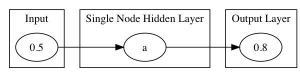

!SLIDE center subsection

# Simple Neural Network Introduction　単純ニューラルネットワークの紹介

This Section introduces Neural Networks starting with a very basic example　基本的事例を使ったニューラルネットワークの紹介

!SLIDE
# Simple Neural Network　単純ニューラルネットワーク

* Simple Network Details　単純ネットワークの詳細
* Simple Network Lab　単純ネットワークの演習
* Important Network Settings　重要なネットワーク設定
* VGG-16 Demo　 VGG-16デモ

!SLIDE

# Simple Network　単純ネットワーク

## The Goal: Input=0.5 Output=0.8　目標：入力=0.5　出力=0.8

!SLIDE

# The Design:　設計：
* Apply Random weights, plus activation function per neuron => output　ランダムな重みと活性化関数を各ニューロンに適用 => 出力

* Test output: does -0.23 = 0.8 ?　テスト出力：-0.23 = 0.8 ?

!SLIDE

# Calculate error　誤差を算定

* backpropagate to adjust weights　誤差逆伝播法による重み調整
* repeat　繰り返し

!SLIDE

#Output Layer of a Neural Network Can be Configured for Different Purposes:　ニューラルネットワークの出力層は異なる目的によって構成可能
* Classification　分類
  * One of Many　多くの中の1つ
  * Cat, Dog, Soccer Ball, House　猫、犬、サッカーボール、家
* Binary　バイナリー
  * one of two　二者択一
  * True/False　正誤
  * SPAM/Not SPAM　スパムまたはスパムではない
* Continuous　継続
  * Numeric value in range　範囲内の数値
  * House Price　家の値段
* Multi Class　マルチクラス
  * 1 or more of Many　1または多数

~~~SECTION:notes~~~
Classification as one of Many, but instead Picture can contain cat and baseball so you do sigmoid with MXCENT

~~~ENDSECTION~~~

!SLIDE

# Simple Network Settings　単純ネットワークの設定

Simple Network has Settings that will become familiar as they are used in all Neural Networks　単純ネットワークにはすべてのニューラルネットワークで使用されている設定が行われる

* Learning Rate　学習率
* Updater　アップデーター
* Output Activation　出力の活性化
* Hidden Layer Activation　隠れ層の活性化
* Number of Epochs　エポック数
* Loss Function　損失関数

!SLIDE

# Extrapolate from Simple Network　単純ネットワークの推定

* Simple Network took one value in and one value out and trained the network to learn the correct value　単純ネットワークにおいては、値を1つ入力し値を1つ出力し、正しい値を学ぶようにネットワークを訓練した
* More complex data same process　より複雑なデータでも同じプロセス
* Input can be images, row data, documents　画像、生データ、文書が入力可能
* Output can be T/F, range of values, labels of a class　T / F、値の範囲、クラスのラベルが出力できる

~~~SECTION:notes~~~

# Sharpen the correlation from simple to complex　単純から複雑な相関関係へ

Multiple GPU support　複数のGPUに対応
• 4 x NVIDIA Titan, off-the-shelf workstation　4 x NVIDIA Titan、既製のワークステーション
• data parallelism for training and testing　訓練とテスト用のデータ並列処理
• ~3.75 times speed-up, 2-3 weeks for training　〜3.75倍のスピードアップ、2〜3週間の訓練

~~~ENDSECTION~~~

!SLIDE

# Simple Network Lab　単純ネットワーク演習

* See your Lab Manual　演習マニュアルを参照

!SLIDE

# VGG-16 Demo　 VGG-16デモ

*  Instructor demonstration of a more complex Neural Network　講師による、さらに複雑なニューラルネットワークのデモンストレーション

!SLIDE

# Questions　質問

Why do we do deep learning? 　ディープラーニングを使用する理由は？

Which requires Expert ?
　特徴量を設計する専門家が必要な場合は？

A. Deep Learning B.Machine Learning　A.ディープラーニングB.機械学習

~~~SECTION:notes~~~
Review Lab and add questions as appropriate

* What is the Learning Rate and what effect does it have on the Neural Network?
* Activation Function is set per Layer or for the whole Network?
* The error of the output compared to the expected output is?
  A. Loss Function
  B. Sigmoid Function
  C. Learning Rate
* Stochastic Gradient Descent is an example of
  A. Updater
  B. Activation Function
  C. Loss Function

~~~ENDSECTION~~~

!SLIDE
