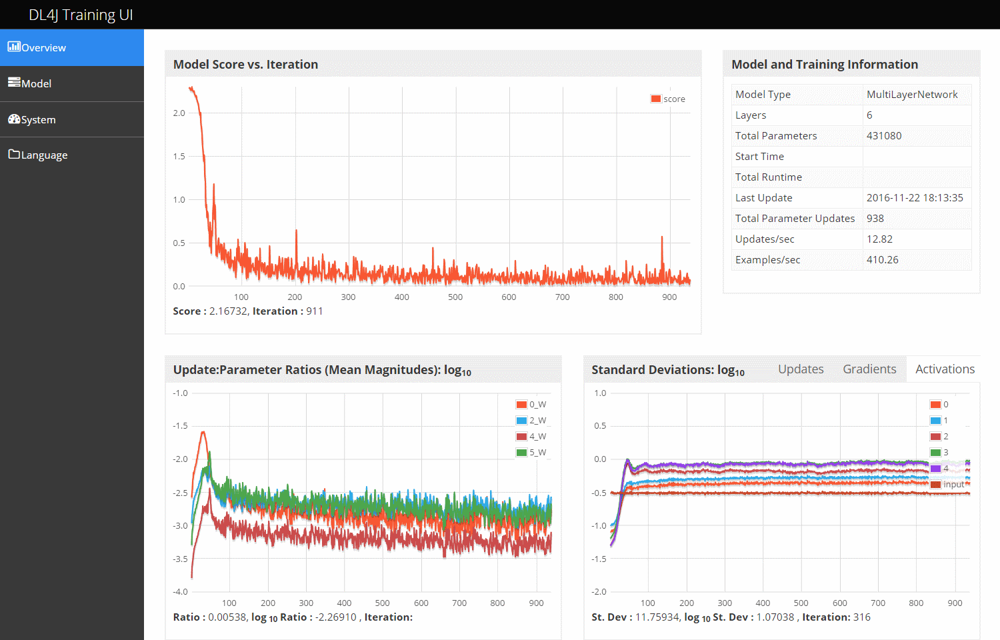
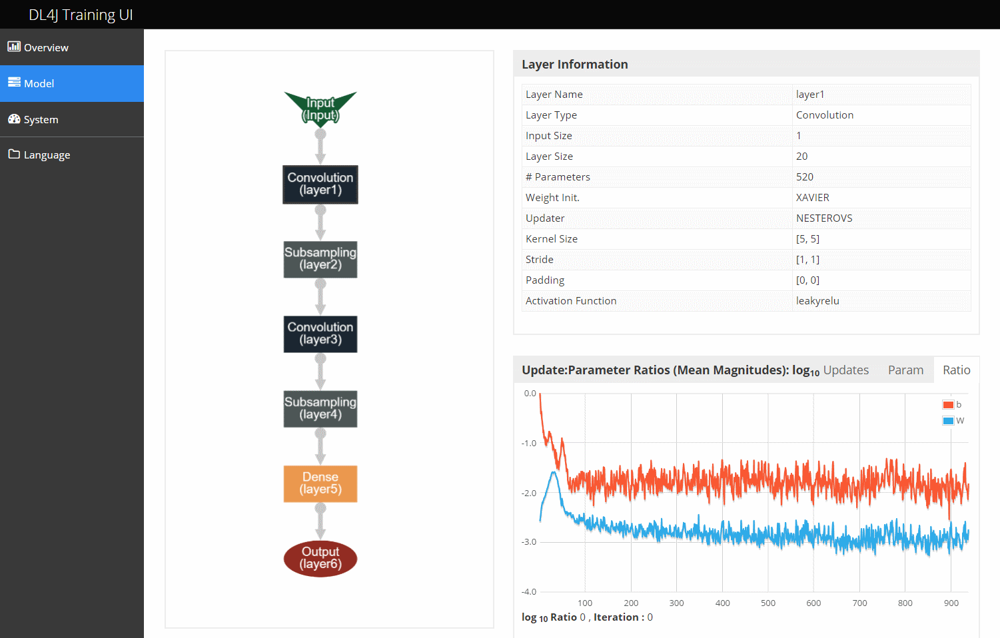

!SLIDE center subsection

# DeepLearning4J Training UI　 DeepLearning4J訓練用ユーザーインターフェース（UI）

!SLIDE

# Visualizing Network Training with the Deeplearning4j Training UI　 DeepLearning4J訓練用UIによるネットワークトレーニングの可視化

* Browser Based　ブラウザベース
* Real Time　リアルタイム

!SLIDE

# Using the Training UI　訓練用UIを使用

* Add Dependency to Pom.xml　 Pom.xmlへdependencyを追加
* Add code to your class　クラスにコードを追加

*

!SLIDE

# Maven and pom.xml 　Mavenとpom.xml

* Maven is a dependency management and build tool 　Mavenは依存関係を管理するビルドツール
* Maven Configuration stored in pom.xml 　Maven設定はpom.xmlに格納
* Maven Repository stored locally in ~/.m2　 Mavenリポジトリはローカル〜/ .m2に格納

!SLIDE

# pom.xml

	<dependency>
        <groupId>org.deeplearning4j</groupId>
        <artifactId>deeplearning4j-ui_2.10</artifactId>
        <version>${dl4j.version}</version>
    </dependency>

!SLIDE

# Code for UI　 UIのコード

	//Initialize the user interface backend　ユーザーインターフェイスのバックエンドを初期化
	UIServer uiServer = UIServer.getInstance();

	//Configure where the network information 　ネットワーク情報の場所を設定
	//(gradients, score vs. time etc) is to be stored. 　（勾配、スコアvs時間など）を格納
	//Here: store in memory.　こちら：メモリーに保存
    StatsStorage statsStorage = new InMemoryStatsStorage();         
	//Alternative: new FileStatsStorage(File), for saving and loading later　代替方法：保存し後にローディングするために新しいFileStatsStorage(File)
    
    //Attach the StatsStorage instance to the UI: 　UIにStatsStorageインスタンスをアタッチ
	//this allows the contents of the StatsStorage to be visualized　これによりStatsStorageのコンテンツが視覚化される
    uiServer.attach(statsStorage);

    //Then add the StatsListener 　次にStatsListenerを追加
	//to collect this information from the network, as it trains　訓練するとともにネットワークからこの情報を収集する
    net.setListeners(new StatsListener(statsStorage));

!SLIDE

# Viewing the UI　 UIを見る

* http://localhost:9000/train

!SLIDE

# Configuring the UI　UI設定

* System Property org.deeplearning4j.ui.port 
* Switch Port　ポートを切り替え

		-Dorg.deeplearning4j.ui.port=9001
		
		
!SLIDE 

# UI execution　UI実行

* Information is collected and routed to the UI when you call the fit method on your network.　 ネットワーク上でフィットメソッドを呼び出すと、情報が収集されUIにルーティングされる

!SLIDE

# Code Example　コード例

https://github.com/deeplearning4j/dl4j-examples/blob/master/dl4j-examples/src/main/java/org/deeplearning4j/examples/userInterface/UIExample.java

!SLIDE

# Overview Page　概要ページ

!SLIDE

# Using the Overview Page　概要ページを使う

* Top left: score vs iteration chart - this is the value of the loss function on the current minibatch　左上：スコアvs反復チャート – 現行ミニバッチの損失関数の値
* Top right: model and training information　右上：モデルと訓練に関する情報
* Bottom left: Ratio of parameters to updates (by layer) for all network weights vs. iteration　左下：すべてのネットワークの重みvs反復のパラメータと更新の比率（層別）
* Bottom right: Standard deviations (vs. time) of: activations, gradients and updates　*右下：活性化、勾配、更新の標準偏差（vs時間）

!SLIDE

# Model Page　モデルページ

!SLIDE

# Model Page　モデルページ

* On the right, the following charts are available, after selecting a layer: 　右側では、層を選択した後、次のチャートが利用可能
  * Table of layer information　層の情報に関するテーブル
  * Update to parameter ratio for this layer, as per the overview page. The components of this ratio (the parameter and update mean magnitudes) are also available via tabs.　この層の更新対パラメーターの比率（概要ページを参照）。この比率構成（パラメータと更新の平均的大きさ）はタブでも利用可能
  * Layer activations (mean and mean +/- 2 standard deviations) over time　層の活性化（平均および平均+/- 2標準偏差）
  * Histograms of parameters and updates, for each parameter type　各パラメータータイプにおけるパラメーターおよび更新のヒストグラム
  * Learning rate vs. time (note this will be flat, unless learning rate schedules are used)　学習率　vs学習時間（学習率スケジュールが使用されなければ、フラットになるので注意）

~~~SECTION:notes~~~

Note: parameters are labeled as follows: weights (W) and biases (b). For recurrent neural networks, W refers to the weights connecting the layer to the layer below, and RW refers to the recurrent weights (i.e., those between time steps).

~~~ENDSECTION~~~

!SLIDE

# Deeplearning4J UI and Spark Training　 DeepLearning4JのUIとSparkの訓練

* Conflict with Spark Dependencies　 Sparkの依存関係とのコンフリクト
* Solution　解決策
  * Collect and save the relevant stats, to be visualized (offline) at a later point　後に（オフライン）視覚化するために、関連統計を収集、保存する。
  * Run the UI in a separate server, and Use the remote UI functionality to upload the data from the Spark master to your UI instance 　UIを別のサーバーで実行し、リモートUI機能を使用してSparkマスターからUIインスタンスにデータをアップロード

!SLIDE

# Offline Use　オフラインでの使用

* Collecting Stats　統計収集

	SparkDl4jMultiLayer sparkNet = new SparkDl4jMultiLayer(sc, conf, tm);
    
    StatsStorage ss = new FileStatsStorage(new File("myNetworkTrainingStats.dl4j"));
    sparkNet.setListeners(ss, Collections.singletonList(new StatsListener(null)));

* Load for Later use　後に使用するために読み込み

	StatsStorage statsStorage = new FileStatsStorage(statsFile);    
	//If file already exists: load the data from it
    UIServer uiServer = UIServer.getInstance();
    uiServer.attach(statsStorage);
	
	
	
!SLIDE

# Remote UI　リモートUI

* In JVM running the UI: JVMで実行されているUI

	UIServer uiServer = UIServer.getInstance();
    uiServer.enableRemoteListener();        
	//Necessary: remote support is not enabled by default　リモートサポートはデフォルト設定にないため必要
	
* In the Spark Training instance: Sparkの訓練インスタンス

	SparkDl4jMultiLayer sparkNet = new SparkDl4jMultiLayer(sc, conf, tm);
	StatsStorageRouter remoteUIRouter = 
	new RemoteUIStatsStorageRouter("http://UI_MACHINE_IP:9000");
    sparkNet.setListeners(remoteUIRouter, 
	Collections.singletonList(new StatsListener(null)));

!SLIDE

# Using UI to Tune Your Network　 UIによるネットワーク調整

* Score vs. Iteration　スコアvs反復
* Goal: Decrease　目標：減少
* If Increasing　もしも増加している場合
  * Reduce Learning Rate　学習率を低下
  * Incorrect Normalization? 　不正確な正規化？
* Slow decrease or Flat? 減少率の低減またはフラット？
  * Learning Rate to Low　学習率を低下
  * Optimization Challenges, try or adjust adaptive updater　最適化に問題、適応型アップデータを試行または調整
	* Nesterovs (momentum), RMSProp or Adagrad　 Nesterovs（モメンタム）、RMSProp 、Adagrad
* Rough or Abnormal Graph　ラフまたは異常グラフ
  * Verify Data is shuffled　データがシャッフルされていることを確認

~~~SECTION:notes~~~

The score vs. iteration should (overall) go down over time.

If the score increases consistently, your learning rate is likely set too high. Try reducing it until scores become more stable.
Increasing scores can also be indicative of other network issues, such as incorrect data normalization
If the score is flat or decreases very slowly (over a few hundred iteratons) (a) your learning rate may be too low, or (b) you might be having diffulties with optimization. In the latter case, if you are using the SGD updater, try a different updater such as Nesterovs (momentum), RMSProp or Adagrad.
Note that data that isn’t shuffled (i.e., each minibatch contains only one class, for classification) can result in very rough or abnormal-looking score vs. iteration graphs
Some noise in this line chart is expected (i.e., the line will go up and down within a small range). However, if the scores vary quite significantly between runs variation is very large, this can be a problem
The issues mentioned above (learning rate, normalization, data shuffling) may contribute to this.
Setting the minibatch size to a very small number of examples can also contribute to noisy score vs. iteration graphs, and might lead to optimization difficulties
Overview Page and Model Page - Using the Update:Parameter Ratio Chart

The ratio of mean magnitude of parameters to updates is provided on both the overview and model pages
“Mean magnitude” = the average of the absolute value of the parameters or updates at the current time step
The most important use of this ratio is in selecting a learning rate. As a rule of thumb: this ratio should be around 1:1000 = 0.001. On the (log10) chart, this corresponds to a value of -3 (i.e., 10-3 = 0.001)
Note that is a rough guide only, and may not be appropriate for all networks. It’s often a good starting point, however.
If the ratio diverges significantly from this (for example, > -2 (i.e., 10-2=0.01) or < -4 (i.e., 10-4=0.0001), your parameters may be too unstable to learn useful features, or may change too slowly to learn useful features
To change this ratio, adjust your learning rate (or sometimes, parameter initialization). In some networks, you may need to set the learning rate differently for different layers.
Keep an eye out for unusually large spikes in the ratio: this may indicate exploding gradients
Model Page: Layer Activations (vs. Time) Chart

This chart can be used to detect vanishing or exploding activations (due to poor weight initialization, too much regularization, lack of data normalization, or too high a learning rate).

This chart should ideally stabilize over time (usually a few hundred iterations)
A good standard deviation for the activations is on the order of 0.5 to 2.0. Significantly outside of this range may indicate one of the problems mentioned above.
Model Page: Layer Parameters Histogram

The layer parameters histogram is displayed for the most recent iteration only.

For weights, these histograms should have an approximately Gaussian (normal) distribution, after some time
For biases, these histograms will generally start at 0, and will usually end up being approximately Gaussian
One exception to this is for LSTM recurrent neural network layers: by default, the biases for one gate (the forget gate) are set to 1.0 (by default, though this is configurable), to help in learning dependencies across long time periods. This results in the bias graphs initially having many biases around 0.0, with another set of biases around 1.0
Keep an eye out for parameters that are diverging to +/- infinity: this may be due to too high a learning rate, or insufficient regularization (try adding some L2 regularization to your network).
Keep an eye out for biases that become very large. This can sometimes occur in the output layer for classification, if the distribution of classes is very imbalanced
Model Page: Layer Updates Histogram

The layer update histogram is displayed for the most recent iteration only.

Note that these are the updates - i.e., the gradients after appling learning rate, momentum, regularization etc
As with the parameter graphs, these should have an approximately Gaussian (normal) distribution
Keep an eye out for very large values: this can indicate exploding gradients in your network
Exploding gradients are problematic as they can ‘mess up’ the parameters of your network
In this case, it may indicate a weight initialization, learning rate or input/labels data normalization issue
In the case of recurrent neural networks, adding some gradient normalization or gradient clipping may help
Model Page: Parameter Learning Rates Chart

This chart simply shows the learning rates of the parameters of selected layer, over time.

If you are not using learning rate schedules, the chart will be flat. If you are using learning rate schedules, you can use this chart to track the current value of the learning rate (for each parameter), over time.

~~~ENDSECTION~~~

