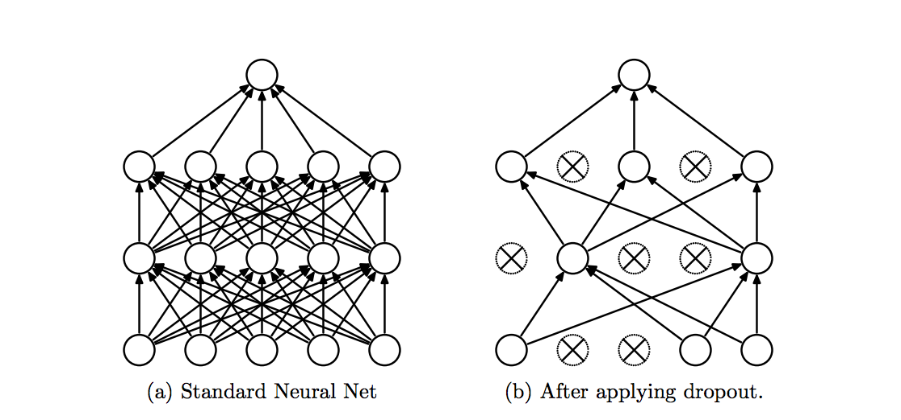

!SLIDE center subsection

# Tuning Neural Networks　ニューラルネットワークの調整

!SLIDE

# Hyper-Parameters that may need tuning　ハイパーパラメータは調整が必要なことがある

* Learning Rate　学習率
* Batch Size　バッチサイズ
* Updater　アップデータ

!SLIDE

# Learning Rate Guidelines　学習率のガイドライン 

* 0.1 to 0.000001　 0.1 ～ 0.000001

!SLIDE

# Learning Rate　学習率

* Adaptive Learning Rate　適応学習率
* Adjust optimizer based on previous updates　直前の更新によりオプティマイザを調整
  * Nesterovs Momentum　 Nesterovs（モメンタム）
  * Adagrad, Adadelta, Adam, RMSPRop

!SLIDE

# Learning Rate Schedules　学習率スケジュール

* Tune Learning Rate as Learning Progresses　学習が進むにつれて学習率を調整
* Based on Schedule or other metrics　スケジュールまたはその他の測定基準に基づく

!SLIDE

# Learning Rate Starting Points　学習率の開始点

* Try .1, .0001 , .000001　1、.0001、.000001を試す
  * Manual Binary Search　手動での二分探索
  * Watch Training UI　訓練用UIを監視
  * Few hundred updates/iterations　数百回の更新・反復
* More thorough　もっと徹底的に行う
  * A few epochs　数回のエポック

~~~SECTION:notes~~~

iteration: one update of the neural net model’s parameters

See this
https://deeplearning4j.org/visualization

~~~ENDSECTION~~~

!SLIDE

# Advanced Learning Rates　高度な学習率

* Can be modified per layer if needed　必要に応じて層ごとに修正可

!SLIDE

# Early Stopping　早期停止

* Stop Training once overfitting is detected　過学習が検出されると、トレーニングを停止

!SLIDE

# Avoiding Overfitting　過学習の回避

* What is Overfitting　過学習とは
  * Scores well on test　テストでは良いスコア
  * Scores poorly on unseen examples　経験したことのない例の場合、悪いスコア
* Has "memorized" training data　訓練データを「記憶」している
* Fails to generalize　一般化できない

!SLIDE

# Regularization　正規化

* l1 and l2 Regularization　 l1 と l2正規化
  * penalizes large network weights　極端な重みのネットワークにペナルティーを与える
  * avoids weights becoming too large　重みが大きくなり過ぎるのを防止
* Risks　リスク
  * Coefficients to high　高い係数
  * Network stops learning　ネットワークが学習を停止
* Common values for regularization　正則化のための共通値
  * 1e-3 to 1e-6.　 1e-3から1e-6

~~~SECTION:notes~~~

Penalizing large weights If cost function is loss plus reguarization function.  If you have lots of big weights that means your net has learned 

If you have classification and Net is only, just mathematical construct forcing weights to be small, then no one weight can dominate output and learning is more distributed. 

l1 allows weights to go to 0 , l2 allows them to get close to 0. 

19:16
http://www.chioka.in/differences-between-l1-and-l2-as-loss-function-and-regularization/

~~~ENDSECTION~~~

!SLIDE

# Dropout　ドロップアウト

* Set probability that a Neuron will be de-activated, set activation to 0　ニューロンが非活性となる確率を設定、活性化を0に設定
* Forces Network to learn different redundant representations　ネットワークに異なる冗長表現を学習させる
* Commonly used dropout rate of 0.5. 　一般にドロップアウト率0.5を使用

!SLIDE

# Dropout　ドロップアウト

~~~SECTION:notes~~~

 So, if you set half of the activations of a layer to zero, the neural network won’t be able to rely on particular activations in a given feed-forward pass during training. 
 
 As a consequence, the neural network will learn different, redundant representations; the network can’t rely on the particular neurons and the combination (or interaction) of these to be present. 
 
 Another nice side effect is that training will be faster.

~~~ENDSECTION~~~

