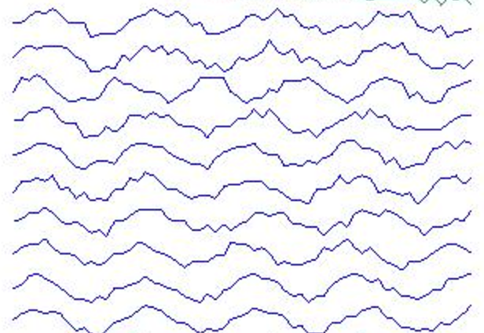
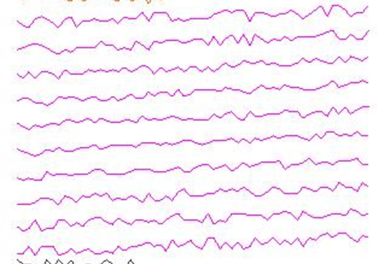
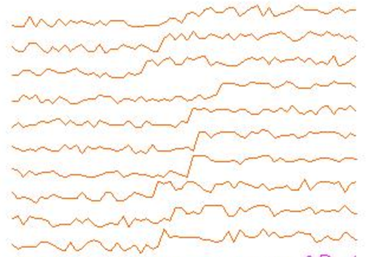

!SLIDE center subsection

# Classification of Univariate Time Series Using LSTM　 LSTMを用いた単変量時系列の分類

!SLIDE

# The Data　データ

* Source: University California at Irvine　出典：カリフォルニア大学アーバイン校

~~~SECTION:notes~~~

 Tom patch this !!!

INSTRUCTOR NOTES LOOK LIKE THIS

~~~ENDSECTION~~~

!SLIDE

# The Data Represents signal data of 6 different type　異なる6種類の信号データを表す

!SLIDE

# Normal　正常

!SLIDE

# Cyclic　周期的

!SLIDE

# Increasing trend　上向きの傾向

!SLIDE

# Decreasing trend　下向きの傾向

!SLIDE

# Upward shift　上方移動

!SLIDE

# Downward shift　下方移動

!SLIDE

# TODO: Describe how the data is stored　 課題：データの保存方法を記述せよ
* Describe how the data is processed in DataVec　 DataVecによるデータの処理方法を記述せよ

~~~SECTION:notes~~~

# Update outline
Tom patch this !!!

~~~ENDSECTION~~~

