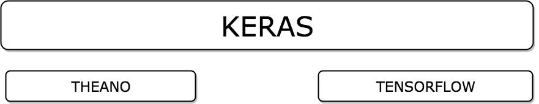

!SLIDE center subsection

# Introduction to Keras

!SLIDE

# What is Keras

* Deep Learning Toolkit for building Neural Networks
* Uses Theano or Tensorflow for graph processing
* Uses Numpy Scikit learn for data wrangling

!SLIDE 

# Keras Diagram

