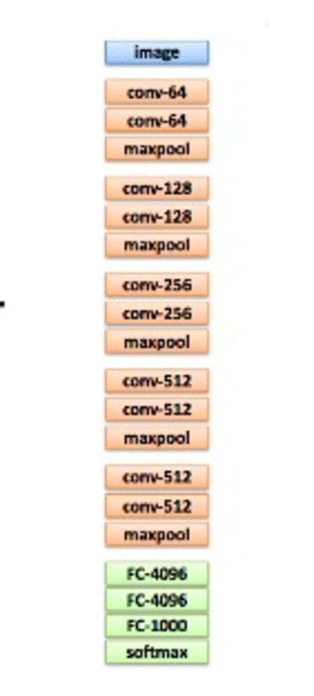

!SLIDE

# Performance Challenges of DeepLearning

* Compute intensive process

!SLIDE

# Solutions

* Move from CPUs to GPUs
* Parallelism
* Shard the dataset
* Train on Multiple Cores
* Train on Multiple Machines

!SLIDE

# Deep Learning Review

* Simple Neural Network
* Classify Flowers by measurements

!SLIDE

# The Data

	5.1,3.5,1.4,0.2,0
	4.9,3.0,1.4,0.2,0
	4.7,3.2,1.3,0.2,0
	4.6,3.1,1.5,0.2,0

!SLIDE

# The Code

* https://github.com/deeplearning4j/dl4j-examples/blob/master/dl4j-examples/src/main/java/org/deeplearning4j/examples/dataexamples/CSVExample.java

!SLIDE

# Code Overview

* Read the Data
* Build a model
* Train the model

!SLIDE

# Performance Data Iris Model

* read 150 lines 3KB
* Train the model 39 parameters

!SLIDE

# Picture of Model Graph

!SLIDE

# VGG16

* Read 14,197,122 images
* Augment with image transformations
* Manage 13,8357,544 parameters
* 21 Layers
* Train for 72 epochs

!SLIDE 

# Picture of VGG

